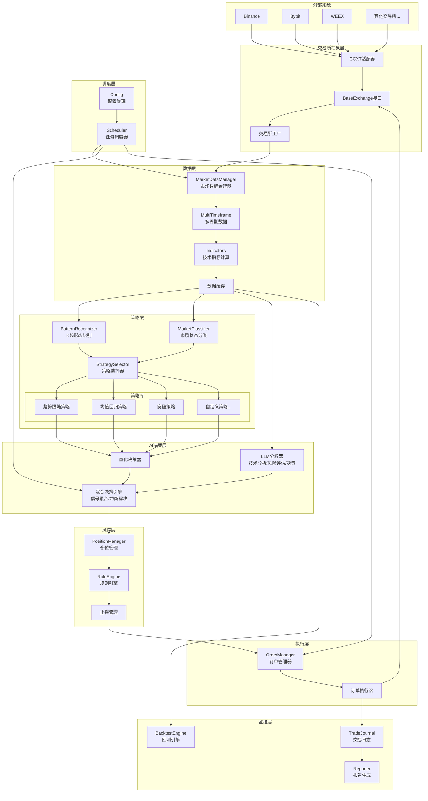
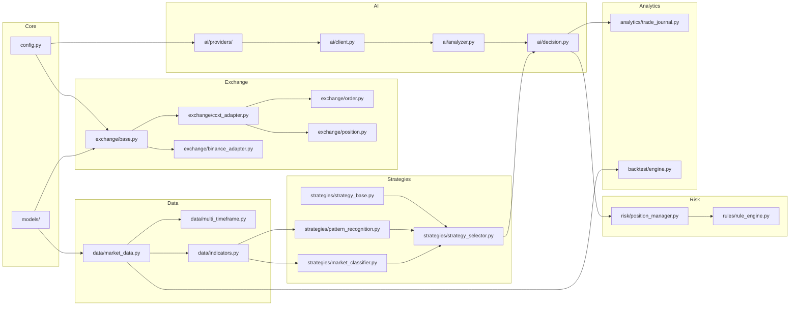

# AI量化交易系统 - 系统架构

> 本文档是 [AI量化交易系统升级规划](./ai_quant_system_plan.md) 的子文档

---

## 整体架构

---

## 模块依赖关系

---

## 相关文档

- [主文档](./ai_quant_system_plan.md)
- [交易分析流程图](./ai_quant_plan_flow.md)
- [Phase 1: CCXT集成](./ai_quant_plan_phase1_ccxt.md)
