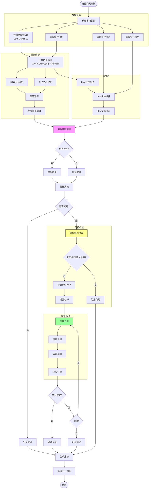
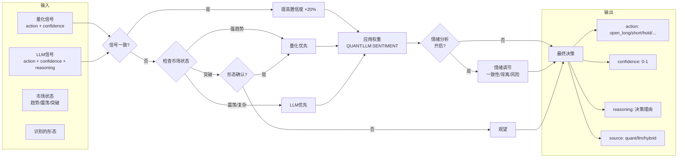
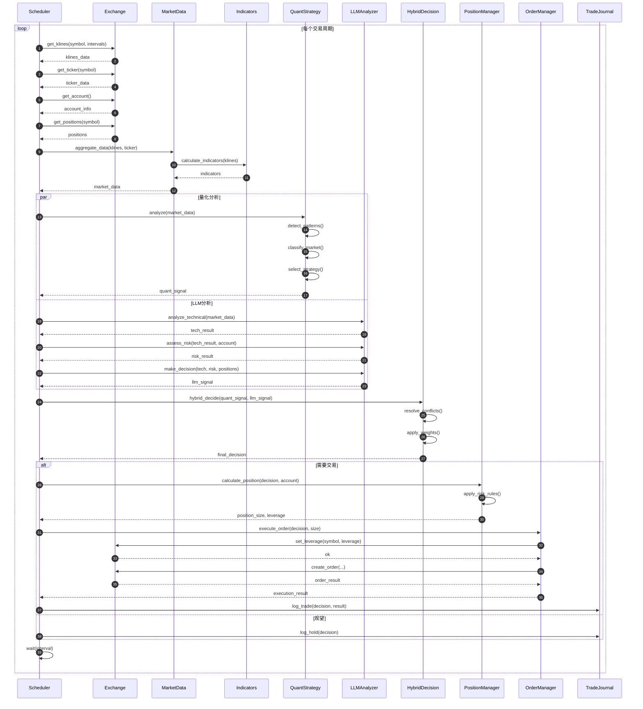
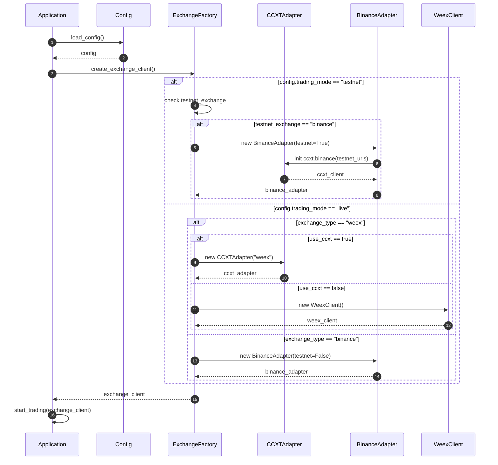
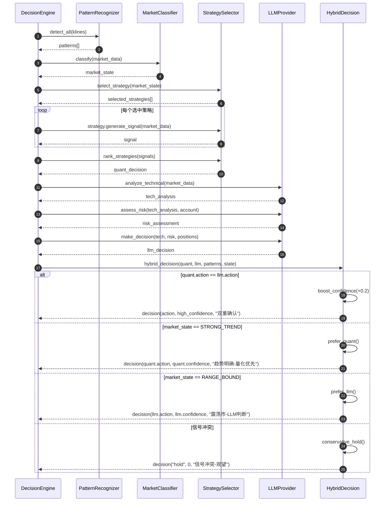

# AI量化交易系统 - 交易分析流程图

> 本文档是 [AI量化交易系统升级规划](./ai_quant_system_plan.md) 的子文档

---

## 完整交易周期

---

## 混合决策详细流程

---

## 时序图

### 主交易循环时序

### 交易所切换时序

### 混合决策时序

---

## 相关文档

- [主文档](./ai_quant_system_plan.md)
- [系统架构](./ai_quant_plan_architecture.md)
- [Phase 4: 量化策略模型集成](./ai_quant_plan_phase4_quant.md)
