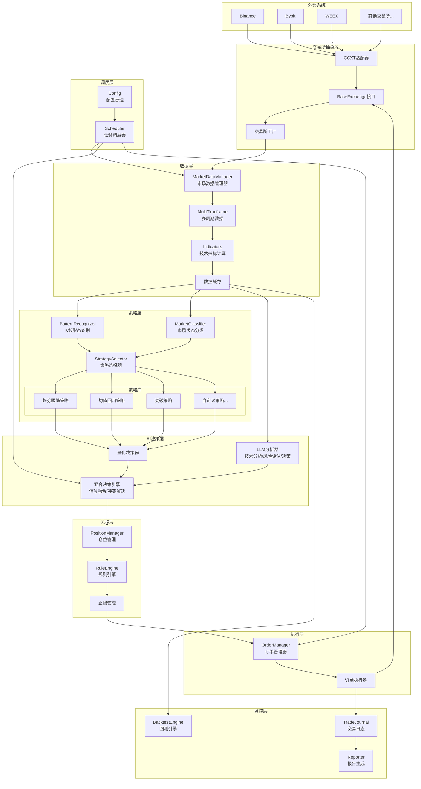
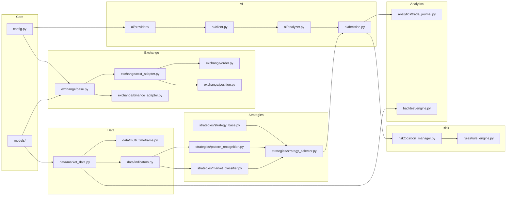
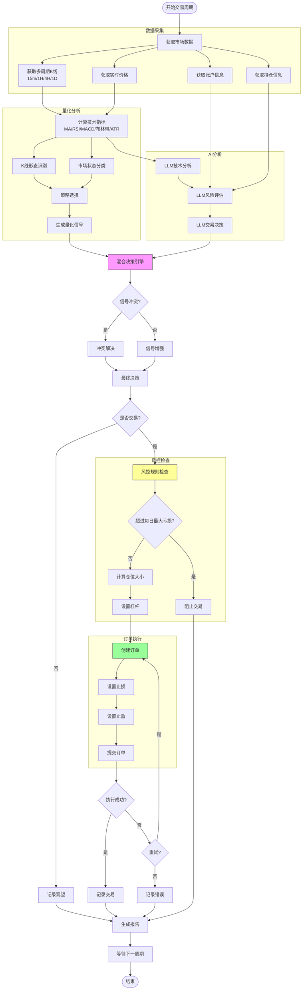
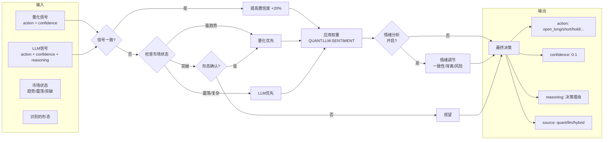
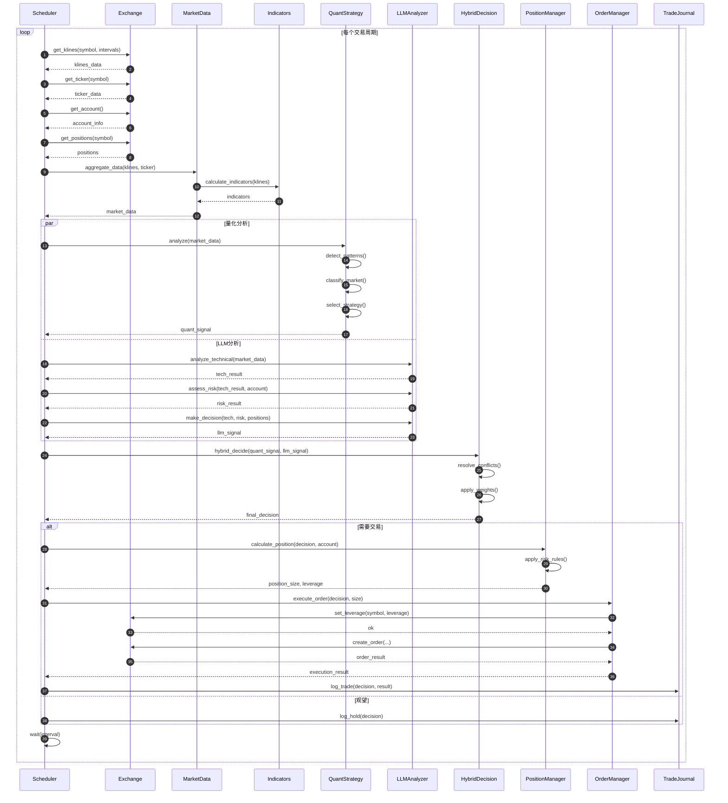
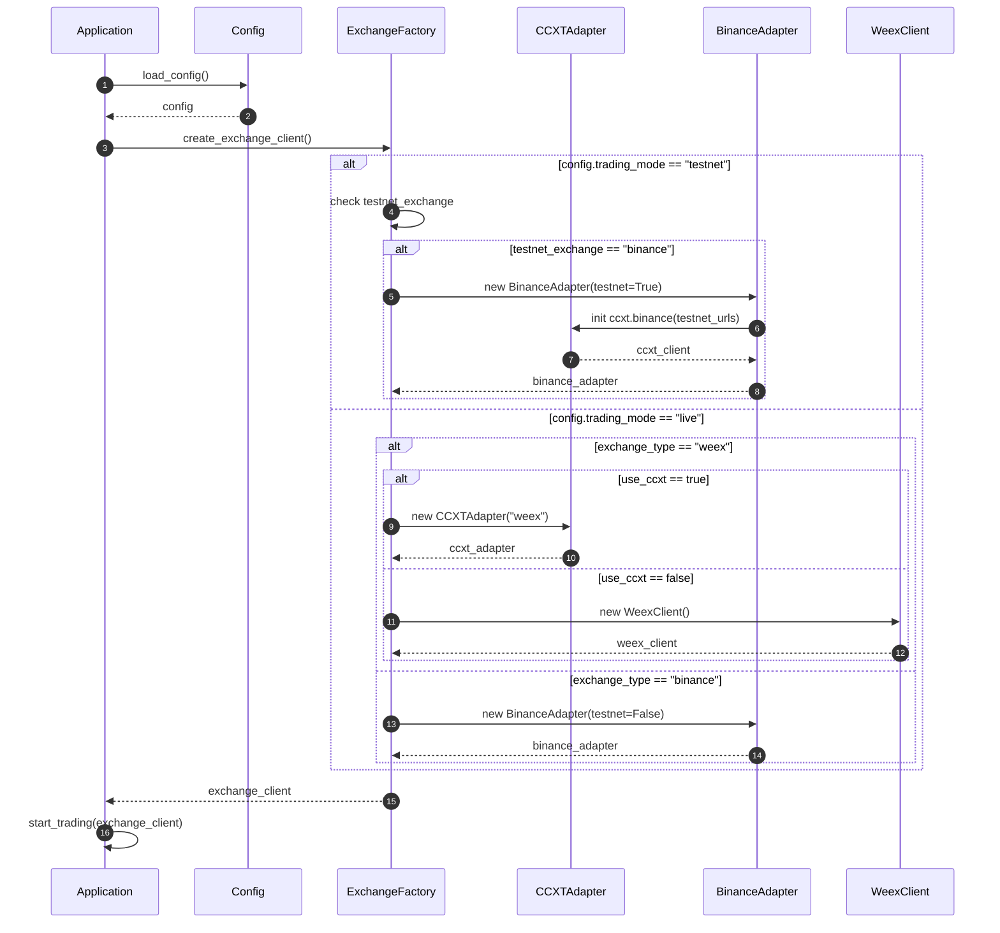
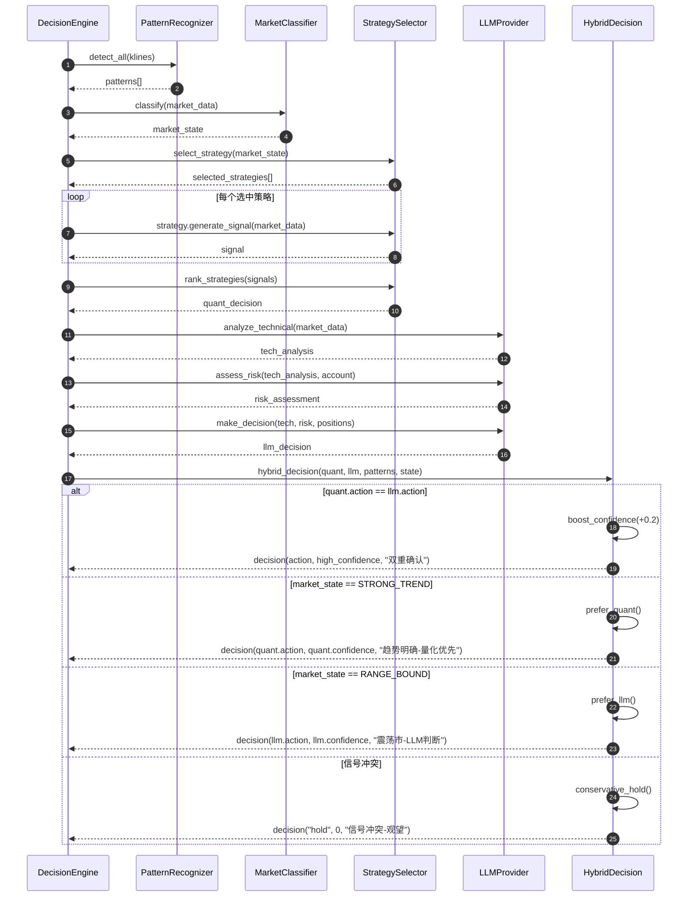

# AI量化交易系统升级规划

## 项目概述

将现有的纯LLM驱动的AI交易系统升级为**混合量化交易系统**，集成：
1. CCXT统一交易所接口（支持多平台）
2. 模拟交易环境（Testnet）
3. 专业交易员流程（多时间框架、仓位管理、风控体系）
4. 传统量化策略（K线形态识别、市场状态分类、多策略并行）
5. 情绪分析（社交媒体/新闻情绪作为决策参考）

## 相关文档

- [交易知识文档](./trading_knowledge.md) - K线形态、技术指标、风控体系等专业知识

---

## 系统架构图

### 整体架构



### 模块依赖关系



---

## 交易分析流程图

### 完整交易周期



### 混合决策详细流程



---

## 时序图

### 主交易循环时序



### 交易所切换时序



### 混合决策时序



---

## Phase 1: CCXT集成（7天）

### 目标
引入CCXT统一交易所接口，替换自定义WEEX实现，为多交易所支持打基础。

### 关键任务

#### 1.1 设计交易所抽象层
**文件**: `src/ai_trader/exchange/base.py`

定义`BaseExchange`抽象基类，规范接口：
- `get_account()` - 账户信息
- `get_klines()` - K线数据
- `get_ticker()` - 实时价格
- `get_positions()` - 持仓查询
- `set_leverage()` - 杠杆设置
- `create_order()` - 下单

返回值统一为内部模型（`Kline`, `Position`, `Order`）。

```python
"""交易所抽象基类"""

from abc import ABC, abstractmethod
from typing import List, Dict, Any, Optional
from enum import Enum
from pydantic import BaseModel

from ..models.market import Kline
from ..models.order import Order


class OrderSide(str, Enum):
    OPEN_LONG = "open_long"
    OPEN_SHORT = "open_short"
    CLOSE_LONG = "close_long"
    CLOSE_SHORT = "close_short"


class OrderType(str, Enum):
    MARKET = "market"
    LIMIT = "limit"


class Position(BaseModel):
    """持仓模型"""
    symbol: str
    side: str  # long / short
    size: float
    entry_price: float
    mark_price: float
    unrealized_pnl: float
    leverage: int
    margin_mode: str  # cross / isolated
    liquidation_price: Optional[float] = None


class AccountInfo(BaseModel):
    """账户信息模型"""
    total_equity: float
    available_balance: float
    margin_used: float
    unrealized_pnl: float


class Ticker(BaseModel):
    """行情快照"""
    symbol: str
    last_price: float
    bid_price: float
    ask_price: float
    high_24h: float
    low_24h: float
    volume_24h: float
    change_24h: float


class BaseExchange(ABC):
    """交易所抽象基类，所有交易所实现必须继承此类"""

    @abstractmethod
    async def get_account(self) -> AccountInfo:
        """获取账户信息"""
        pass

    @abstractmethod
    async def get_klines(
        self,
        symbol: str,
        interval: str = "15m",
        limit: int = 100
    ) -> List[Kline]:
        """获取K线数据"""
        pass

    @abstractmethod
    async def get_ticker(self, symbol: str) -> Ticker:
        """获取实时行情"""
        pass

    @abstractmethod
    async def get_positions(self, symbol: str) -> List[Position]:
        """获取持仓信息"""
        pass

    @abstractmethod
    async def set_leverage(self, symbol: str, leverage: int) -> bool:
        """设置杠杆倍数"""
        pass

    @abstractmethod
    async def create_order(
        self,
        symbol: str,
        side: OrderSide,
        order_type: OrderType,
        size: float,
        price: Optional[float] = None,
        stop_loss: Optional[float] = None,
        take_profit: Optional[float] = None,
    ) -> Order:
        """创建订单"""
        pass

    @abstractmethod
    async def cancel_order(self, symbol: str, order_id: str) -> bool:
        """取消订单"""
        pass

    @abstractmethod
    async def close(self):
        """关闭连接"""
        pass

    async def __aenter__(self) -> "BaseExchange":
        """异步上下文管理器入口"""
        return self

    async def __aexit__(self, exc_type, exc_val, exc_tb):
        """异步上下文管理器出口"""
        await self.close()
```

#### 1.2 实现CCXT适配器
**文件**: `src/ai_trader/exchange/ccxt_adapter.py`

核心逻辑：
- 包装`ccxt.Exchange`实例
- 转换CCXT数据格式到内部模型
- 统一异常处理

```python
"""CCXT统一适配器"""

import ccxt.async_support as ccxt
from typing import List, Optional, Dict, Any
from datetime import datetime

from .base import (
    BaseExchange, AccountInfo, Ticker, Position,
    OrderSide, OrderType
)
from ..models.market import Kline
from ..models.order import Order
from ..utils.logger import logger


class CCXTAdapter(BaseExchange):
    """CCXT统一交易所适配器"""

    # 时间周期映射: 内部格式 -> CCXT格式
    INTERVAL_MAP = {
        "1m": "1m", "5m": "5m", "15m": "15m", "30m": "30m",
        "1h": "1h", "4h": "4h", "1d": "1d", "1w": "1w",
    }

    def __init__(self, exchange: ccxt.Exchange):
        self._exchange = exchange
        self._exchange_id = exchange.id

    @classmethod
    def from_config(
        cls,
        exchange_id: str,
        api_key: str,
        api_secret: str,
        passphrase: Optional[str] = None,
        testnet: bool = False,
        proxy: Optional[str] = None,
    ) -> "CCXTAdapter":
        """从配置创建适配器"""
        exchange_class = getattr(ccxt, exchange_id, None)
        if exchange_class is None:
            raise ValueError(f"CCXT不支持交易所: {exchange_id}")

        config = {
            "apiKey": api_key,
            "secret": api_secret,
            "enableRateLimit": True,
            "options": {"defaultType": "swap"},  # 合约模式
        }

        if passphrase:
            config["password"] = passphrase

        if proxy:
            config["proxies"] = {"http": proxy, "https": proxy}

        exchange = exchange_class(config)

        # Testnet切换 - 严格模式，不支持则拒绝启动
        # 重要: 仅告警可能导致误连实盘，必须强制失败
        if testnet:
            if hasattr(exchange, 'set_sandbox_mode'):
                exchange.set_sandbox_mode(True)
                logger.info(f"{exchange_id} 已切换到Testnet模式")
            else:
                # 不支持sandbox的交易所，拒绝在testnet模式下使用通用适配器
                raise ValueError(
                    f"{exchange_id} 不支持set_sandbox_mode，无法安全切换到Testnet。"
                    f"请使用专用适配器(如BinanceAdapter)或检查交易所是否支持Testnet。"
                    f"支持Testnet的交易所: binance, bybit"
                )

        return cls(exchange)

    async def get_account(self) -> AccountInfo:
        """获取账户信息"""
        try:
            balance = await self._exchange.fetch_balance()
            usdt = balance.get("USDT", {})
            return AccountInfo(
                total_equity=float(usdt.get("total", 0)),
                available_balance=float(usdt.get("free", 0)),
                margin_used=float(usdt.get("used", 0)),
                unrealized_pnl=0.0,  # 需要从持仓汇总
            )
        except ccxt.BaseError as e:
            logger.error(f"CCXT获取账户失败: {e}")
            raise

    async def get_klines(
        self,
        symbol: str,
        interval: str = "15m",
        limit: int = 100
    ) -> List[Kline]:
        """获取K线数据"""
        try:
            ccxt_interval = self.INTERVAL_MAP.get(interval, interval)
            ohlcv = await self._exchange.fetch_ohlcv(
                symbol, timeframe=ccxt_interval, limit=limit
            )
            return [
                Kline(
                    timestamp=int(candle[0]),
                    open=float(candle[1]),
                    high=float(candle[2]),
                    low=float(candle[3]),
                    close=float(candle[4]),
                    volume=float(candle[5]),
                )
                for candle in ohlcv
            ]
        except ccxt.BaseError as e:
            logger.error(f"CCXT获取K线失败: {e}")
            raise

    async def get_ticker(self, symbol: str) -> Ticker:
        """获取实时行情"""
        try:
            ticker = await self._exchange.fetch_ticker(symbol)
            return Ticker(
                symbol=symbol,
                last_price=float(ticker.get("last", 0)),
                bid_price=float(ticker.get("bid", 0)),
                ask_price=float(ticker.get("ask", 0)),
                high_24h=float(ticker.get("high", 0)),
                low_24h=float(ticker.get("low", 0)),
                volume_24h=float(ticker.get("baseVolume", 0)),
                change_24h=float(ticker.get("percentage", 0)),
            )
        except ccxt.BaseError as e:
            logger.error(f"CCXT获取行情失败: {e}")
            raise

    async def get_positions(self, symbol: str) -> List[Position]:
        """获取持仓信息"""
        try:
            positions = await self._exchange.fetch_positions([symbol])
            return [
                Position(
                    symbol=pos["symbol"],
                    side="long" if pos["side"] == "long" else "short",
                    size=abs(float(pos.get("contracts", 0))),
                    entry_price=float(pos.get("entryPrice", 0)),
                    mark_price=float(pos.get("markPrice", 0)),
                    unrealized_pnl=float(pos.get("unrealizedPnl", 0)),
                    leverage=int(pos.get("leverage", 1)),
                    margin_mode=pos.get("marginMode", "cross"),
                    liquidation_price=pos.get("liquidationPrice"),
                )
                for pos in positions
                if float(pos.get("contracts", 0)) != 0
            ]
        except ccxt.BaseError as e:
            logger.error(f"CCXT获取持仓失败: {e}")
            raise

    async def set_leverage(self, symbol: str, leverage: int) -> bool:
        """设置杠杆倍数"""
        try:
            await self._exchange.set_leverage(leverage, symbol)
            return True
        except ccxt.BaseError as e:
            logger.error(f"CCXT设置杠杆失败: {e}")
            return False

    async def create_order(
        self,
        symbol: str,
        side: OrderSide,
        order_type: OrderType,
        size: float,
        price: Optional[float] = None,
        stop_loss: Optional[float] = None,
        take_profit: Optional[float] = None,
    ) -> Order:
        """创建订单"""
        try:
            # 映射方向
            ccxt_side = "buy" if side in [OrderSide.OPEN_LONG, OrderSide.CLOSE_SHORT] else "sell"
            ccxt_type = order_type.value

            params = {}
            if side in [OrderSide.CLOSE_LONG, OrderSide.CLOSE_SHORT]:
                params["reduceOnly"] = True

            # 注意: stopLoss/takeProfit参数格式因交易所而异
            # Binance: 需要单独创建止损止盈订单
            # Bybit: 支持在下单时附带
            # 此处为简化版本，实际使用需按交易所适配
            # 推荐: 使用专用适配器(如BinanceAdapter)处理止损止盈
            if stop_loss and self._exchange_id in ["bybit", "okx"]:
                params["stopLoss"] = {"triggerPrice": stop_loss}
            if take_profit and self._exchange_id in ["bybit", "okx"]:
                params["takeProfit"] = {"triggerPrice": take_profit}

            result = await self._exchange.create_order(
                symbol=symbol,
                type=ccxt_type,
                side=ccxt_side,
                amount=size,
                price=price,
                params=params,
            )

            return Order(
                order_id=result["id"],
                symbol=symbol,
                side=side.value,
                order_type=order_type.value,
                size=size,
                price=price,
                status=result.get("status", "unknown"),
                filled_size=float(result.get("filled", 0)),
                avg_price=result.get("average"),
                created_at=datetime.now(),
            )
        except ccxt.BaseError as e:
            logger.error(f"CCXT创建订单失败: {e}")
            raise

    async def cancel_order(self, symbol: str, order_id: str) -> bool:
        """取消订单"""
        try:
            await self._exchange.cancel_order(order_id, symbol)
            return True
        except ccxt.BaseError as e:
            logger.error(f"CCXT取消订单失败: {e}")
            return False

    async def close(self):
        """关闭连接"""
        await self._exchange.close()
```

#### 1.3 重构WeexClient
**文件**: `src/ai_trader/exchange/weex_client.py`

改造方案：
```python
class WeexClient(BaseExchange):
    def __init__(self):
        self._ccxt_client = ccxt.weex({...})
        self._adapter = CCXTAdapter(self._ccxt_client)
```

**注意**: 如果CCXT对WEEX支持不完整，保留自定义实现作为fallback。

#### 1.4 配置系统升级
**文件**: `src/ai_trader/config.py`

新增配置项：

```python
# 在 TradingConfig 类中新增以下字段

class TradingConfig(BaseSettings):
    # ... 现有字段 ...

    # ============= 交易所配置 =============
    exchange_type: Literal["weex", "binance", "bybit", "okx"] = Field(
        default="weex", validation_alias="EXCHANGE_TYPE"
    )
    use_ccxt: bool = Field(default=True, validation_alias="USE_CCXT")

    # ============= 运行模式 =============
    trading_mode: Literal["testnet", "live"] = Field(
        default="testnet", validation_alias="TRADING_MODE"
    )

    # ============= Testnet配置 =============
    testnet_exchange: str = Field(default="binance", validation_alias="TESTNET_EXCHANGE")
    testnet_api_key: str = Field(default="", validation_alias="TESTNET_API_KEY")
    testnet_api_secret: str = Field(default="", validation_alias="TESTNET_API_SECRET")

    # ============= Binance配置 =============
    binance_api_key: str = Field(default="", validation_alias="BINANCE_API_KEY")
    binance_api_secret: str = Field(default="", validation_alias="BINANCE_API_SECRET")

    # ============= Bybit配置 =============
    bybit_api_key: str = Field(default="", validation_alias="BYBIT_API_KEY")
    bybit_api_secret: str = Field(default="", validation_alias="BYBIT_API_SECRET")

    # ============= OKX配置 =============
    okx_api_key: str = Field(default="", validation_alias="OKX_API_KEY")
    okx_api_secret: str = Field(default="", validation_alias="OKX_API_SECRET")
    okx_passphrase: str = Field(default="", validation_alias="OKX_PASSPHRASE")

    def get_exchange_credentials(self, exchange_type: str) -> dict:
        """获取指定交易所的凭证"""
        credentials_map = {
            "weex": {
                "api_key": self.weex_api_key,
                "api_secret": self.weex_api_secret,
                "passphrase": self.weex_passphrase,
            },
            "binance": {
                "api_key": self.binance_api_key,
                "api_secret": self.binance_api_secret,
            },
            "bybit": {
                "api_key": self.bybit_api_key,
                "api_secret": self.bybit_api_secret,
            },
            "okx": {
                "api_key": self.okx_api_key,
                "api_secret": self.okx_api_secret,
                "passphrase": self.okx_passphrase,
            },
        }
        creds = credentials_map.get(exchange_type)
        if not creds or not creds.get("api_key"):
            raise ValueError(f"未配置{exchange_type}的API凭证")
        return creds

    # ============= 决策模式 =============
    decision_mode: Literal["quant_only", "llm_only", "hybrid"] = Field(
        default="hybrid", validation_alias="DECISION_MODE"
    )
    # 权重配置 (原始值，决策层会自动归一化)
    # 默认比例: 量化50% + LLM35% + 情绪15% = 100%
    quant_weight: float = Field(default=0.50, validation_alias="QUANT_WEIGHT")
    llm_weight: float = Field(default=0.35, validation_alias="LLM_WEIGHT")
    sentiment_weight: float = Field(default=0.15, validation_alias="SENTIMENT_WEIGHT")

    def get_normalized_weights(self) -> dict:
        """获取归一化后的权重，确保总和为1"""
        total = self.quant_weight + self.llm_weight
        if self.sentiment_enabled:
            total += self.sentiment_weight

        if total == 0:
            # 默认均分
            return {"quant": 0.5, "llm": 0.5, "sentiment": 0.0}

        return {
            "quant": self.quant_weight / total,
            "llm": self.llm_weight / total,
            "sentiment": (self.sentiment_weight / total) if self.sentiment_enabled else 0.0,
        }

    # ============= 情绪分析 =============
    sentiment_enabled: bool = Field(default=False, validation_alias="SENTIMENT_ENABLED")

    # ============= 策略选择 =============
    enabled_strategies: str = Field(
        default="trend_following,mean_reversion,breakout",
        validation_alias="ENABLED_STRATEGIES"
    )

    def get_enabled_strategies(self) -> List[str]:
        """获取启用的策略列表"""
        return [s.strip() for s in self.enabled_strategies.split(",")]

    @property
    def is_testnet(self) -> bool:
        return self.trading_mode == "testnet"
```

#### 1.5 依赖注入改造
**文件**: `src/ai_trader/exchange/__init__.py`

引入工厂函数：

```python
"""交易所模块 - 工厂函数"""

from typing import Optional
from .base import BaseExchange
from .ccxt_adapter import CCXTAdapter
from .weex_client import WeexClient
from ..config import config
from ..utils.logger import logger


def create_exchange_client() -> BaseExchange:
    """创建交易所客户端实例

    根据配置自动选择合适的实现：
    - testnet模式: 使用专用适配器连接testnet交易所
    - live模式: 根据use_ccxt配置选择CCXT或原生实现
    """
    from .binance_adapter import BinanceAdapter

    # Testnet仅允许有专用适配器或明确支持的交易所
    SUPPORTED_TESTNET_EXCHANGES = ["binance", "bybit"]

    if config.trading_mode == "testnet":
        exchange = config.testnet_exchange.lower()
        logger.info(f"创建Testnet客户端: {exchange}")

        if exchange not in SUPPORTED_TESTNET_EXCHANGES:
            raise ValueError(
                f"Testnet模式不支持 {exchange}。"
                f"支持的交易所: {SUPPORTED_TESTNET_EXCHANGES}。"
                f"请使用实盘模式或切换到支持的交易所。"
            )

        # Binance使用专用适配器
        if exchange == "binance":
            return BinanceAdapter(
                api_key=config.testnet_api_key,
                api_secret=config.testnet_api_secret,
                testnet=True,
                proxy=config.proxy_url or None,
            )

        # Bybit等其他支持的交易所使用CCXT适配器
        # 注意: CCXTAdapter.from_config会校验set_sandbox_mode支持
        return CCXTAdapter.from_config(
            exchange_id=exchange,
            api_key=config.testnet_api_key,
            api_secret=config.testnet_api_secret,
            testnet=True,
            proxy=config.proxy_url or None,
        )

    # Live模式 - 使用各交易所独立的凭证
    exchange_type = config.exchange_type
    creds = config.get_exchange_credentials(exchange_type)

    if exchange_type == "weex":
        if config.use_ccxt:
            try:
                return CCXTAdapter.from_config(
                    exchange_id="weex",
                    api_key=creds["api_key"],
                    api_secret=creds["api_secret"],
                    passphrase=creds.get("passphrase"),
                    testnet=False,
                    proxy=config.proxy_url or None,
                )
            except ValueError:
                logger.warning("CCXT不支持WEEX，回退到原生实现")
                return WeexClient()
        else:
            return WeexClient()

    elif exchange_type == "binance":
        # Binance推荐使用专用适配器
        return BinanceAdapter(
            api_key=creds["api_key"],
            api_secret=creds["api_secret"],
            testnet=False,
            proxy=config.proxy_url or None,
        )

    else:
        # 其他交易所使用通用CCXT适配器 + 各自凭证
        return CCXTAdapter.from_config(
            exchange_id=exchange_type,
            api_key=creds["api_key"],
            api_secret=creds["api_secret"],
            passphrase=creds.get("passphrase"),
            testnet=False,
            proxy=config.proxy_url or None,
        )


# 导出
__all__ = [
    "BaseExchange",
    "CCXTAdapter",
    "WeexClient",
    "create_exchange_client",
]
```

#### 1.6 测试
**文件**: `tests/exchange/test_ccxt_adapter.py`

验证：
- 数据格式转换正确性
- 与原WEEX实现行为一致
- 所有现有测试通过

### 依赖变更
```toml
[dependencies]
ccxt = ">=4.2.0"
```

### 验证方法
1. 回归测试通过
2. Testnet对比测试（CCXT vs 原生实现）

### 风险控制
- CCXT可能不支持WEEX → 保留原生实现
- 性能损耗 → 监控延迟指标

---

## Phase 2: 模拟交易环境（8天）

### 目标
接入Binance/Bybit Testnet，搭建无风险验证环境。

### 关键任务

#### 2.1 调研交易所Testnet
**输出**: `docs/testnet_research.md`

评估维度：
- API接口完整度
- 数据真实性
- 文档质量

**推荐选择**: Binance Testnet（优先）+ Bybit Testnet（备选）

#### 2.2 环境切换配置
**文件**: `src/ai_trader/config.py`

```python
trading_mode: Literal["testnet", "live"] = "testnet"
testnet_exchange: str = "binance"
testnet_api_key: str
testnet_api_secret: str
```

#### 2.3 实现Binance适配器
**文件**: `src/ai_trader/exchange/binance_adapter.py`

```python
"""Binance交易所适配器 - 支持Testnet"""

import ccxt.async_support as ccxt
from typing import Optional

from .ccxt_adapter import CCXTAdapter
from ..utils.logger import logger


class BinanceAdapter(CCXTAdapter):
    """Binance交易所适配器，继承CCXT适配器并添加Binance特定配置"""

    # Binance Testnet URLs
    TESTNET_URLS = {
        "fapiPublic": "https://testnet.binancefuture.com/fapi/v1",
        "fapiPrivate": "https://testnet.binancefuture.com/fapi/v1",
        "fapiPrivateV2": "https://testnet.binancefuture.com/fapi/v2",
    }

    def __init__(
        self,
        api_key: str,
        api_secret: str,
        testnet: bool = False,
        proxy: Optional[str] = None,
    ):
        config = {
            "apiKey": api_key,
            "secret": api_secret,
            "enableRateLimit": True,
            "options": {
                "defaultType": "future",  # 使用U本位合约
                "adjustForTimeDifference": True,  # 自动校准时间戳
            },
        }

        if testnet:
            config["sandbox"] = True
            # Binance Testnet需要特殊URL配置
            config["urls"] = {"api": self.TESTNET_URLS}
            logger.info("使用Binance Testnet环境")

        if proxy:
            config["proxies"] = {"http": proxy, "https": proxy}

        exchange = ccxt.binance(config)
        super().__init__(exchange)

    @classmethod
    def create(
        cls,
        api_key: str,
        api_secret: str,
        testnet: bool = False,
        proxy: Optional[str] = None,
    ) -> "BinanceAdapter":
        """工厂方法创建适配器"""
        return cls(api_key, api_secret, testnet, proxy)

    async def set_position_mode(self, hedge_mode: bool = True) -> bool:
        """设置持仓模式

        Args:
            hedge_mode: True=双向持仓, False=单向持仓
        """
        try:
            await self._exchange.fapiPrivatePostPositionSideDual({
                "dualSidePosition": "true" if hedge_mode else "false"
            })
            logger.info(f"设置持仓模式: {'双向' if hedge_mode else '单向'}")
            return True
        except ccxt.BaseError as e:
            # 如果已经是目标模式，会报错但不影响
            if "No need to change" in str(e):
                return True
            logger.error(f"设置持仓模式失败: {e}")
            return False

    async def set_margin_type(self, symbol: str, margin_type: str = "CROSSED") -> bool:
        """设置保证金模式

        Args:
            symbol: 交易对
            margin_type: CROSSED(全仓) / ISOLATED(逐仓)
        """
        try:
            await self._exchange.fapiPrivatePostMarginType({
                "symbol": symbol.replace("/", "").replace(":USDT", ""),
                "marginType": margin_type,
            })
            logger.info(f"设置保证金模式: {margin_type}")
            return True
        except ccxt.BaseError as e:
            if "No need to change" in str(e):
                return True
            logger.error(f"设置保证金模式失败: {e}")
            return False

    async def get_funding_rate(self, symbol: str) -> float:
        """获取资金费率"""
        try:
            result = await self._exchange.fapiPublicGetPremiumIndex({
                "symbol": symbol.replace("/", "").replace(":USDT", "")
            })
            return float(result.get("lastFundingRate", 0))
        except ccxt.BaseError as e:
            logger.error(f"获取资金费率失败: {e}")
            return 0.0
```

#### 2.4 工厂函数增强
**文件**: `src/ai_trader/exchange/__init__.py`

```python
def create_exchange_client() -> BaseExchange:
    if config.trading_mode == "testnet":
        if config.testnet_exchange == "binance":
            # 使用专用适配器，传入testnet凭证
            return BinanceAdapter(
                api_key=config.testnet_api_key,
                api_secret=config.testnet_api_secret,
                testnet=True,
                proxy=config.proxy_url or None,
            )
    elif config.trading_mode == "live":
        creds = config.get_exchange_credentials(config.exchange_type)
        return WeexClient()  # 或其他实现
```
> 完整实现见 Phase 1.5 工厂函数

#### 2.5 测试验证
**文件**: `tests/exchange/test_testnet_live_parity.py`

对比testnet和live的：
- K线数据一致性
- 订单流程完整性

### 验证方法
在Binance Testnet运行完整交易周期（数据获取 → 决策 → 下单）。

### 风险控制
- Testnet数据滞后 → 选择大厂交易所
- API限制更严格 → 调整请求频率

---

## Phase 3: 专业交易员流程（11天）

### 目标
研究专业交易员逻辑，结构化为AI可执行模块。

### 关键任务

#### 3.1 交易员流程调研
**输出**: `docs/professional_trading_research.md`

研究方向：
1. **多时间框架分析**: 4H看趋势，15m找入场点
2. **仓位管理金字塔**: 初始10% → 盈利加仓至30% → 最大50%
3. **止损纪律**: 硬止损（技术位）+ 移动止损（盈利后移到成本价）
4. **风险回报比**: 至少1:2

#### 3.2 多时间框架分析
**文件**: `src/ai_trader/data/multi_timeframe.py`

```python
"""多时间框架数据分析"""

from typing import List, Optional, Dict
from enum import Enum
from pydantic import BaseModel

from ..models.market import MarketData, Kline, Indicators
from ..exchange.base import BaseExchange
from .indicators import calculate_indicators


class Trend(str, Enum):
    """趋势方向"""
    UP = "up"
    DOWN = "down"
    SIDEWAYS = "sideways"


class TimeframeAnalysis(BaseModel):
    """单时间框架分析结果"""
    interval: str
    trend: Trend
    trend_strength: float  # 0-100
    support: float
    resistance: float
    ma_position: str  # above_ma / below_ma / crossing


class MultiTimeframeData(BaseModel):
    """多时间框架聚合数据"""
    symbol: str
    current_price: float

    # 各时间框架数据
    tf_15m: MarketData
    tf_1h: MarketData
    tf_4h: MarketData
    tf_1d: MarketData

    # 各时间框架分析结果
    analysis_15m: Optional[TimeframeAnalysis] = None
    analysis_1h: Optional[TimeframeAnalysis] = None
    analysis_4h: Optional[TimeframeAnalysis] = None
    analysis_1d: Optional[TimeframeAnalysis] = None

    @property
    def trend_alignment(self) -> bool:
        """多周期趋势是否一致"""
        trends = [
            self.analysis_15m.trend if self.analysis_15m else None,
            self.analysis_1h.trend if self.analysis_1h else None,
            self.analysis_4h.trend if self.analysis_4h else None,
        ]
        valid_trends = [t for t in trends if t is not None]
        if len(valid_trends) < 2:
            return False
        return len(set(valid_trends)) == 1

    @property
    def dominant_trend(self) -> Trend:
        """获取主导趋势（以大周期为准）"""
        # 权重: 1D > 4H > 1H > 15m
        if self.analysis_1d and self.analysis_1d.trend != Trend.SIDEWAYS:
            return self.analysis_1d.trend
        if self.analysis_4h and self.analysis_4h.trend != Trend.SIDEWAYS:
            return self.analysis_4h.trend
        if self.analysis_1h:
            return self.analysis_1h.trend
        return Trend.SIDEWAYS

    @property
    def trend_score(self) -> float:
        """趋势一致性评分 (0-100)"""
        weights = {"1d": 0.4, "4h": 0.3, "1h": 0.2, "15m": 0.1}
        analyses = {
            "1d": self.analysis_1d,
            "4h": self.analysis_4h,
            "1h": self.analysis_1h,
            "15m": self.analysis_15m,
        }

        score = 0.0
        dominant = self.dominant_trend

        for tf, analysis in analyses.items():
            if analysis and analysis.trend == dominant:
                score += weights[tf] * analysis.trend_strength

        return min(100, score)


class MultiTimeframeManager:
    """多时间框架数据管理器"""

    INTERVALS = ["15m", "1h", "4h", "1d"]

    def __init__(self, exchange: BaseExchange):
        self._exchange = exchange

    async def fetch_all(self, symbol: str, limit: int = 100) -> MultiTimeframeData:
        """获取所有时间框架数据"""
        import asyncio

        # 并行获取所有周期K线
        tasks = [
            self._fetch_market_data(symbol, interval, limit)
            for interval in self.INTERVALS
        ]
        results = await asyncio.gather(*tasks)

        tf_15m, tf_1h, tf_4h, tf_1d = results

        # 获取当前价格
        ticker = await self._exchange.get_ticker(symbol)

        mtf = MultiTimeframeData(
            symbol=symbol,
            current_price=ticker.last_price,
            tf_15m=tf_15m,
            tf_1h=tf_1h,
            tf_4h=tf_4h,
            tf_1d=tf_1d,
        )

        # 分析各时间框架
        mtf.analysis_15m = self._analyze_timeframe(tf_15m)
        mtf.analysis_1h = self._analyze_timeframe(tf_1h)
        mtf.analysis_4h = self._analyze_timeframe(tf_4h)
        mtf.analysis_1d = self._analyze_timeframe(tf_1d)

        return mtf

    async def _fetch_market_data(
        self, symbol: str, interval: str, limit: int
    ) -> MarketData:
        """获取单个时间框架的市场数据"""
        klines = await self._exchange.get_klines(symbol, interval, limit)
        ticker = await self._exchange.get_ticker(symbol)
        indicators = calculate_indicators(klines)

        return MarketData(
            symbol=symbol,
            current_price=ticker.last_price,
            klines=klines,
            interval=interval,
            indicators=indicators,
            high_24h=ticker.high_24h,
            low_24h=ticker.low_24h,
            change_24h=ticker.change_24h,
            volume_24h=ticker.volume_24h,
        )

    def _analyze_timeframe(self, market_data: MarketData) -> TimeframeAnalysis:
        """分析单个时间框架"""
        klines = market_data.klines
        indicators = market_data.indicators

        # 判断趋势
        trend = self._determine_trend(klines, indicators)

        # 计算趋势强度 (基于ADX，需要在indicators中添加)
        trend_strength = min(100, abs(indicators.macd_histogram) * 10)

        # 计算支撑阻力
        recent_lows = [k.low for k in klines[-20:]]
        recent_highs = [k.high for k in klines[-20:]]
        support = min(recent_lows)
        resistance = max(recent_highs)

        # 判断价格与MA关系
        current_price = klines[-1].close
        if current_price > indicators.ma25:
            ma_position = "above_ma"
        elif current_price < indicators.ma25:
            ma_position = "below_ma"
        else:
            ma_position = "crossing"

        return TimeframeAnalysis(
            interval=market_data.interval,
            trend=trend,
            trend_strength=trend_strength,
            support=support,
            resistance=resistance,
            ma_position=ma_position,
        )

    def _determine_trend(self, klines: List[Kline], indicators: Indicators) -> Trend:
        """判断趋势方向"""
        # MA排列判断
        ma_bullish = indicators.ma7 > indicators.ma25 > indicators.ma99
        ma_bearish = indicators.ma7 < indicators.ma25 < indicators.ma99

        # MACD判断
        macd_bullish = indicators.macd > indicators.macd_signal
        macd_bearish = indicators.macd < indicators.macd_signal

        # 综合判断
        if ma_bullish and macd_bullish:
            return Trend.UP
        elif ma_bearish and macd_bearish:
            return Trend.DOWN
        else:
            return Trend.SIDEWAYS
```

#### 3.3 仓位管理模块
**文件**: `src/ai_trader/risk/position_manager.py`

功能：
- `calculate_initial_position()` - 初始建仓量
- `should_add_position()` - 加仓判断
- `calculate_trailing_stop()` - 移动止损

```python
"""仓位管理模块"""

from typing import Optional, Tuple
from enum import Enum
from pydantic import BaseModel
from decimal import Decimal, ROUND_DOWN

from ..exchange.base import Position, AccountInfo
from ..config import config
from ..utils.logger import logger


class PositionAction(str, Enum):
    """仓位操作"""
    HOLD = "hold"
    ADD = "add"
    REDUCE = "reduce"
    CLOSE = "close"


class StopLossType(str, Enum):
    """止损类型"""
    HARD = "hard"          # 固定止损
    TRAILING = "trailing"  # 移动止损
    BREAKEVEN = "breakeven"  # 保本止损


class PositionSizing(BaseModel):
    """仓位计算结果"""
    size: float
    leverage: int
    entry_price: float
    stop_loss: float
    take_profit: float
    risk_amount: float  # 风险金额
    risk_percent: float  # 风险比例


class PositionManager:
    """仓位管理器

    实现专业交易员的仓位管理策略:
    1. 固定比例风控: 单笔风险不超过账户的1-2%
    2. 金字塔加仓: 盈利后逐步加仓
    3. 移动止损: 盈利后移动止损保护利润
    """

    # 仓位配置
    INITIAL_RISK_PERCENT = 0.01  # 初始风险1%
    MAX_RISK_PERCENT = 0.02      # 最大风险2%
    MAX_POSITION_PERCENT = 0.50  # 最大仓位50%

    # 金字塔加仓配置
    PYRAMID_LEVELS = [
        {"profit_r": 1.0, "add_percent": 0.10},  # 盈利1R后加仓10%
        {"profit_r": 2.0, "add_percent": 0.10},  # 盈利2R后再加10%
        {"profit_r": 3.0, "add_percent": 0.10},  # 盈利3R后再加10%
    ]

    # 移动止损配置
    TRAILING_STOP_LEVELS = [
        {"profit_r": 1.0, "stop_at_r": 0.0},   # 盈利1R，止损移到成本价
        {"profit_r": 2.0, "stop_at_r": 1.0},   # 盈利2R，止损移到+1R
        {"profit_r": 3.0, "stop_at_r": 2.0},   # 盈利3R，止损移到+2R
    ]

    def __init__(self):
        self.current_risk_percent = self.INITIAL_RISK_PERCENT

    def calculate_initial_position(
        self,
        account: AccountInfo,
        entry_price: float,
        stop_loss_price: float,
        leverage: int = 5,
    ) -> PositionSizing:
        """计算初始建仓量

        公式: 仓位 = (账户余额 × 风险比例) / (入场价 - 止损价)

        Args:
            account: 账户信息
            entry_price: 计划入场价
            stop_loss_price: 止损价
            leverage: 杠杆倍数

        Returns:
            PositionSizing: 仓位计算结果
        """
        # 计算风险金额
        risk_amount = account.available_balance * self.current_risk_percent

        # 计算每单位风险
        price_risk = abs(entry_price - stop_loss_price)
        if price_risk == 0:
            logger.warning("止损价等于入场价，无法计算仓位")
            return self._empty_sizing(entry_price)

        # 计算仓位大小
        position_size = risk_amount / price_risk

        # 检查是否超过最大仓位限制
        max_size = (account.available_balance * self.MAX_POSITION_PERCENT * leverage) / entry_price
        position_size = min(position_size, max_size)

        # 计算止盈价 (默认2R)
        risk_r = price_risk
        if entry_price > stop_loss_price:  # 做多
            take_profit = entry_price + (risk_r * 2)
        else:  # 做空
            take_profit = entry_price - (risk_r * 2)

        # 精度处理
        position_size = float(Decimal(str(position_size)).quantize(
            Decimal("0.001"), rounding=ROUND_DOWN
        ))

        return PositionSizing(
            size=position_size,
            leverage=leverage,
            entry_price=entry_price,
            stop_loss=stop_loss_price,
            take_profit=take_profit,
            risk_amount=risk_amount,
            risk_percent=self.current_risk_percent * 100,
        )

    def should_add_position(
        self,
        position: Position,
        current_price: float,
        original_stop_loss: float,
    ) -> Tuple[bool, float]:
        """判断是否应该加仓

        Args:
            position: 当前持仓
            current_price: 当前价格
            original_stop_loss: 原始止损价（用于计算初始风险R）

        Returns:
            (是否加仓, 加仓比例)
        """
        if position.size == 0:
            return False, 0.0

        entry_price = position.entry_price

        # 使用与calculate_initial_position一致的风险定义
        # 初始风险R = |入场价 - 止损价|
        initial_risk = abs(entry_price - original_stop_loss)
        if initial_risk == 0:
            logger.warning("初始风险为0，无法判断加仓条件")
            return False, 0.0

        # 计算当前盈利R值
        if position.side == "long":
            price_diff = current_price - entry_price
        else:
            price_diff = entry_price - current_price

        profit_r = price_diff / initial_risk

        # 检查是否达到加仓条件
        for level in self.PYRAMID_LEVELS:
            if profit_r >= level["profit_r"]:
                # 检查是否已经在该级别加过仓 (需要外部记录)
                return True, level["add_percent"]

        return False, 0.0

    def calculate_trailing_stop(
        self,
        position: Position,
        current_price: float,
        original_stop: float,
    ) -> float:
        """计算移动止损价

        Args:
            position: 当前持仓
            current_price: 当前价格
            original_stop: 原始止损价

        Returns:
            新的止损价
        """
        entry_price = position.entry_price
        is_long = position.side == "long"

        # 计算初始风险
        initial_risk = abs(entry_price - original_stop)
        if initial_risk == 0:
            return original_stop

        # 计算当前盈利R值
        if is_long:
            profit_r = (current_price - entry_price) / initial_risk
        else:
            profit_r = (entry_price - current_price) / initial_risk

        # 根据盈利情况移动止损
        new_stop = original_stop
        for level in self.TRAILING_STOP_LEVELS:
            if profit_r >= level["profit_r"]:
                if is_long:
                    new_stop = entry_price + (initial_risk * level["stop_at_r"])
                else:
                    new_stop = entry_price - (initial_risk * level["stop_at_r"])

        # 止损只能往有利方向移动
        if is_long:
            return max(new_stop, original_stop)
        else:
            return min(new_stop, original_stop) if new_stop > 0 else original_stop

    def check_daily_loss_limit(
        self,
        account: AccountInfo,
        daily_pnl: float,
        max_daily_loss_percent: float = 0.03,
    ) -> bool:
        """检查是否超过每日最大亏损限制

        Args:
            account: 账户信息
            daily_pnl: 当日盈亏
            max_daily_loss_percent: 最大每日亏损比例 (默认3%)

        Returns:
            True=已超限，应停止交易
        """
        max_loss = account.total_equity * max_daily_loss_percent
        if daily_pnl < -max_loss:
            logger.warning(f"触发每日最大亏损限制: {daily_pnl:.2f} < -{max_loss:.2f}")
            return True
        return False

    def calculate_risk_reward_ratio(
        self,
        entry_price: float,
        stop_loss: float,
        take_profit: float,
    ) -> float:
        """计算风险回报比

        Args:
            entry_price: 入场价
            stop_loss: 止损价
            take_profit: 止盈价

        Returns:
            风险回报比 (如 2.0 表示 1:2)
        """
        risk = abs(entry_price - stop_loss)
        reward = abs(take_profit - entry_price)
        if risk == 0:
            return 0.0
        return reward / risk

    def _empty_sizing(self, price: float) -> PositionSizing:
        """返回空仓位"""
        return PositionSizing(
            size=0.0,
            leverage=1,
            entry_price=price,
            stop_loss=price,
            take_profit=price,
            risk_amount=0.0,
            risk_percent=0.0,
        )
```

#### 3.4 规则引擎（可选）
**文件**: `src/ai_trader/rules/rule_engine.py`

```python
class TradingRule(ABC):
    @abstractmethod
    def evaluate(self, context: TradingContext) -> RuleResult:
        pass

class MaxDailyLossRule(TradingRule):
    """每日最大亏损规则"""
    ...
```

#### 3.5 交易日志系统
**文件**: `src/ai_trader/analytics/trade_journal.py`

记录每笔交易的完整上下文：
- 市场状态
- 决策理由
- 执行结果
- PnL

#### 3.6 AI Prompt增强
**文件**: `src/ai_trader/prompts/technical.py`, `trading.py`

在提示词中加入：
- 多时间框架分析要求
- 仓位管理规则
- 交易纪律约束

### 验证方法
1. 历史回测验证新架构性能
2. Testnet运行2周观察效果

### 风险控制
- 过度优化 → 使用out-of-sample数据验证
- 复杂度增加 → 模块化设计，逐步迭代

---

## Phase 4: 量化策略模型集成（16天）

### 目标
引入传统量化策略，实现K线形态识别、市场状态分类、混合决策系统。

### 关键任务

#### 4.1 引入量化库
**依赖更新**:
```toml
[dependencies]
pandas-ta = ">=0.3.14"  # 高级技术指标
scipy = ">=1.11.0"      # 数学计算
```

#### 4.2 K线形态识别
**文件**: `src/ai_trader/strategies/pattern_recognition.py`

实现形态：
- 锤子线/上吊线（反转信号）
- 吞没形态（反转）
- 十字星（变盘）
- 头肩顶/底（大级别反转）
- 双顶/双底（M/W形态）
- 三角形整理（突破待确认）

```python
"""K线形态识别模块"""

from typing import List, Optional
from enum import Enum
from pydantic import BaseModel
from datetime import datetime

from ..models.market import Kline


class PatternType(str, Enum):
    """形态类型"""
    # 反转形态
    HAMMER = "hammer"              # 锤子线 (看涨)
    HANGING_MAN = "hanging_man"    # 上吊线 (看跌)
    BULLISH_ENGULFING = "bullish_engulfing"  # 看涨吞没
    BEARISH_ENGULFING = "bearish_engulfing"  # 看跌吞没
    DOJI = "doji"                  # 十字星
    MORNING_STAR = "morning_star"  # 早晨之星 (看涨)
    EVENING_STAR = "evening_star"  # 黄昏之星 (看跌)

    # 整理形态
    DOUBLE_TOP = "double_top"      # 双顶 (看跌)
    DOUBLE_BOTTOM = "double_bottom"  # 双底 (看涨)
    HEAD_SHOULDERS = "head_shoulders"  # 头肩顶
    INV_HEAD_SHOULDERS = "inv_head_shoulders"  # 头肩底


class PatternSignal(str, Enum):
    """形态信号"""
    BULLISH = "bullish"
    BEARISH = "bearish"
    NEUTRAL = "neutral"


class Pattern(BaseModel):
    """识别到的形态"""
    pattern_type: PatternType
    signal: PatternSignal
    confidence: float  # 0-1
    start_index: int
    end_index: int
    description: str


class PatternRecognizer:
    """K线形态识别器"""

    def __init__(self):
        self.min_body_ratio = 0.1  # 最小实体比例

    def detect_all(self, klines: List[Kline]) -> List[Pattern]:
        """检测所有形态"""
        if len(klines) < 3:
            return []

        patterns = []

        # 单K线形态
        hammer = self.detect_hammer(klines)
        if hammer:
            patterns.append(hammer)

        doji = self.detect_doji(klines)
        if doji:
            patterns.append(doji)

        # 双K线形态
        engulfing = self.detect_engulfing(klines)
        if engulfing:
            patterns.append(engulfing)

        # 三K线形态
        star = self.detect_star_pattern(klines)
        if star:
            patterns.append(star)

        # 多K线形态 (需要更多数据)
        if len(klines) >= 20:
            double = self.detect_double_pattern(klines)
            if double:
                patterns.append(double)

        return patterns

    def detect_hammer(self, klines: List[Kline]) -> Optional[Pattern]:
        """检测锤子线/上吊线

        特征:
        - 小实体在K线顶部
        - 下影线长度 >= 实体 * 2
        - 几乎没有上影线
        """
        if len(klines) < 5:
            return None

        candle = klines[-1]
        body = abs(candle.close - candle.open)
        upper_shadow = candle.high - max(candle.open, candle.close)
        lower_shadow = min(candle.open, candle.close) - candle.low

        # 检测条件
        if body == 0:
            return None
        if lower_shadow < body * 2:
            return None
        if upper_shadow > body * 0.3:
            return None

        # 判断趋势方向 (用前4根K线判断)
        prev_closes = [k.close for k in klines[-5:-1]]
        is_downtrend = prev_closes[-1] < prev_closes[0]
        is_uptrend = prev_closes[-1] > prev_closes[0]

        if is_downtrend:
            return Pattern(
                pattern_type=PatternType.HAMMER,
                signal=PatternSignal.BULLISH,
                confidence=0.7,
                start_index=len(klines) - 1,
                end_index=len(klines) - 1,
                description="锤子线：下跌趋势中出现，可能反转上涨",
            )
        elif is_uptrend:
            return Pattern(
                pattern_type=PatternType.HANGING_MAN,
                signal=PatternSignal.BEARISH,
                confidence=0.6,
                start_index=len(klines) - 1,
                end_index=len(klines) - 1,
                description="上吊线：上涨趋势中出现，可能反转下跌",
            )

        return None

    def detect_doji(self, klines: List[Kline]) -> Optional[Pattern]:
        """检测十字星

        特征: 开盘价 ≈ 收盘价，实体极小
        """
        candle = klines[-1]
        body = abs(candle.close - candle.open)
        total_range = candle.high - candle.low

        if total_range == 0:
            return None

        body_ratio = body / total_range

        if body_ratio < 0.1:  # 实体占比小于10%
            return Pattern(
                pattern_type=PatternType.DOJI,
                signal=PatternSignal.NEUTRAL,
                confidence=0.6,
                start_index=len(klines) - 1,
                end_index=len(klines) - 1,
                description="十字星：市场犹豫，可能变盘",
            )

        return None

    def detect_engulfing(self, klines: List[Kline]) -> Optional[Pattern]:
        """检测吞没形态

        看涨吞没: 阴线后出现大阳线，完全覆盖前一根
        看跌吞没: 阳线后出现大阴线，完全覆盖前一根
        """
        if len(klines) < 2:
            return None

        prev = klines[-2]
        curr = klines[-1]

        prev_body = prev.close - prev.open
        curr_body = curr.close - curr.open

        # 看涨吞没: 前阴后阳，阳线完全覆盖阴线
        if prev_body < 0 and curr_body > 0:
            if curr.open <= prev.close and curr.close >= prev.open:
                return Pattern(
                    pattern_type=PatternType.BULLISH_ENGULFING,
                    signal=PatternSignal.BULLISH,
                    confidence=0.75,
                    start_index=len(klines) - 2,
                    end_index=len(klines) - 1,
                    description="看涨吞没：强烈看涨反转信号",
                )

        # 看跌吞没: 前阳后阴，阴线完全覆盖阳线
        if prev_body > 0 and curr_body < 0:
            if curr.open >= prev.close and curr.close <= prev.open:
                return Pattern(
                    pattern_type=PatternType.BEARISH_ENGULFING,
                    signal=PatternSignal.BEARISH,
                    confidence=0.75,
                    start_index=len(klines) - 2,
                    end_index=len(klines) - 1,
                    description="看跌吞没：强烈看跌反转信号",
                )

        return None

    def detect_star_pattern(self, klines: List[Kline]) -> Optional[Pattern]:
        """检测早晨之星/黄昏之星

        早晨之星: 大阴线 → 小实体(星线) → 大阳线
        黄昏之星: 大阳线 → 小实体(星线) → 大阴线
        """
        if len(klines) < 3:
            return None

        first = klines[-3]
        star = klines[-2]
        third = klines[-1]

        first_body = first.close - first.open
        star_body = abs(star.close - star.open)
        third_body = third.close - third.open

        avg_body = sum(abs(k.close - k.open) for k in klines[-10:-3]) / 7 if len(klines) >= 10 else star_body * 3

        # 早晨之星: 大阴线 + 小星线 + 大阳线
        if first_body < -avg_body * 0.5 and star_body < avg_body * 0.3 and third_body > avg_body * 0.5:
            if third.close > (first.open + first.close) / 2:  # 阳线收盘超过阴线中点
                return Pattern(
                    pattern_type=PatternType.MORNING_STAR,
                    signal=PatternSignal.BULLISH,
                    confidence=0.8,
                    start_index=len(klines) - 3,
                    end_index=len(klines) - 1,
                    description="早晨之星：强烈看涨反转信号",
                )

        # 黄昏之星: 大阳线 + 小星线 + 大阴线
        if first_body > avg_body * 0.5 and star_body < avg_body * 0.3 and third_body < -avg_body * 0.5:
            if third.close < (first.open + first.close) / 2:  # 阴线收盘低于阳线中点
                return Pattern(
                    pattern_type=PatternType.EVENING_STAR,
                    signal=PatternSignal.BEARISH,
                    confidence=0.8,
                    start_index=len(klines) - 3,
                    end_index=len(klines) - 1,
                    description="黄昏之星：强烈看跌反转信号",
                )

        return None

    def detect_double_pattern(self, klines: List[Kline]) -> Optional[Pattern]:
        """检测双顶/双底形态"""
        if len(klines) < 20:
            return None

        highs = [k.high for k in klines[-20:]]
        lows = [k.low for k in klines[-20:]]

        # 找局部高点
        local_highs = []
        for i in range(2, len(highs) - 2):
            if highs[i] > highs[i-1] and highs[i] > highs[i-2] and \
               highs[i] > highs[i+1] and highs[i] > highs[i+2]:
                local_highs.append((i, highs[i]))

        # 找局部低点
        local_lows = []
        for i in range(2, len(lows) - 2):
            if lows[i] < lows[i-1] and lows[i] < lows[i-2] and \
               lows[i] < lows[i+1] and lows[i] < lows[i+2]:
                local_lows.append((i, lows[i]))

        # 检测双顶
        if len(local_highs) >= 2:
            h1, h2 = local_highs[-2], local_highs[-1]
            if abs(h1[1] - h2[1]) / h1[1] < 0.02:  # 两个高点相差不超过2%
                return Pattern(
                    pattern_type=PatternType.DOUBLE_TOP,
                    signal=PatternSignal.BEARISH,
                    confidence=0.7,
                    start_index=len(klines) - 20 + h1[0],
                    end_index=len(klines) - 1,
                    description="双顶形态：可能向下突破",
                )

        # 检测双底
        if len(local_lows) >= 2:
            l1, l2 = local_lows[-2], local_lows[-1]
            if abs(l1[1] - l2[1]) / l1[1] < 0.02:  # 两个低点相差不超过2%
                return Pattern(
                    pattern_type=PatternType.DOUBLE_BOTTOM,
                    signal=PatternSignal.BULLISH,
                    confidence=0.7,
                    start_index=len(klines) - 20 + l1[0],
                    end_index=len(klines) - 1,
                    description="双底形态：可能向上突破",
                )

        return None
```

#### 4.3 市场状态分类
**文件**: `src/ai_trader/strategies/market_classifier.py`

市场状态：
- 强趋势（ADX>25）→ 趋势跟随策略
- 震荡（ADX<20）→ 区间交易策略
- 突破（放量突破）→ 追单策略
- 横盘 → 观望

```python
"""市场状态分类器"""

from typing import List, Tuple
from enum import Enum
from pydantic import BaseModel
import numpy as np

from ..models.market import MarketData, Kline


class MarketState(str, Enum):
    """市场状态"""
    STRONG_TREND = "strong_trend"    # 强趋势
    WEAK_TREND = "weak_trend"        # 弱趋势
    RANGE_BOUND = "range_bound"      # 震荡区间
    BREAKOUT = "breakout"            # 突破
    SIDEWAYS = "sideways"            # 横盘


class TrendDirection(str, Enum):
    """趋势方向"""
    UP = "up"
    DOWN = "down"
    NONE = "none"


class MarketClassification(BaseModel):
    """市场分类结果"""
    state: MarketState
    direction: TrendDirection
    adx: float
    volatility: float  # ATR百分比
    volume_ratio: float  # 当前成交量/平均成交量
    confidence: float


class MarketClassifier:
    """市场状态分类器

    使用ADX判断趋势强度，结合成交量和波动率进行分类
    """

    def __init__(self):
        self.adx_period = 14
        self.atr_period = 14

    def classify(self, market_data: MarketData) -> MarketClassification:
        """分类市场状态"""
        klines = market_data.klines

        if len(klines) < 30:
            return MarketClassification(
                state=MarketState.SIDEWAYS,
                direction=TrendDirection.NONE,
                adx=0,
                volatility=0,
                volume_ratio=1.0,
                confidence=0.3,
            )

        # 计算ADX
        adx, plus_di, minus_di = self.calculate_adx(klines)

        # 计算波动率 (ATR / 价格)
        atr = self.calculate_atr(klines)
        volatility = (atr / klines[-1].close) * 100

        # 计算成交量比率
        volume_ratio = self._calculate_volume_ratio(klines)

        # 判断趋势方向
        direction = self._determine_direction(plus_di, minus_di, klines)

        # 分类市场状态
        state, confidence = self._classify_state(
            adx, volatility, volume_ratio, klines
        )

        return MarketClassification(
            state=state,
            direction=direction,
            adx=adx,
            volatility=volatility,
            volume_ratio=volume_ratio,
            confidence=confidence,
        )

    def calculate_adx(self, klines: List[Kline], period: int = 14) -> Tuple[float, float, float]:
        """计算ADX指标

        Returns:
            (ADX, +DI, -DI)
        """
        if len(klines) < period * 2:
            return 0.0, 0.0, 0.0

        highs = np.array([k.high for k in klines])
        lows = np.array([k.low for k in klines])
        closes = np.array([k.close for k in klines])

        # 计算True Range
        tr = np.maximum(
            highs[1:] - lows[1:],
            np.maximum(
                np.abs(highs[1:] - closes[:-1]),
                np.abs(lows[1:] - closes[:-1])
            )
        )

        # 计算+DM和-DM
        plus_dm = np.where(
            (highs[1:] - highs[:-1]) > (lows[:-1] - lows[1:]),
            np.maximum(highs[1:] - highs[:-1], 0),
            0
        )
        minus_dm = np.where(
            (lows[:-1] - lows[1:]) > (highs[1:] - highs[:-1]),
            np.maximum(lows[:-1] - lows[1:], 0),
            0
        )

        # 平滑计算
        atr = self._ema(tr, period)
        plus_di = 100 * self._ema(plus_dm, period) / atr
        minus_di = 100 * self._ema(minus_dm, period) / atr

        # 计算DX和ADX
        dx = 100 * np.abs(plus_di - minus_di) / (plus_di + minus_di + 1e-10)
        adx = self._ema(dx, period)

        return float(adx[-1]), float(plus_di[-1]), float(minus_di[-1])

    def calculate_atr(self, klines: List[Kline], period: int = 14) -> float:
        """计算ATR"""
        if len(klines) < period:
            return 0.0

        highs = np.array([k.high for k in klines])
        lows = np.array([k.low for k in klines])
        closes = np.array([k.close for k in klines])

        tr = np.maximum(
            highs[1:] - lows[1:],
            np.maximum(
                np.abs(highs[1:] - closes[:-1]),
                np.abs(lows[1:] - closes[:-1])
            )
        )

        atr = self._ema(tr, period)
        return float(atr[-1])

    def _ema(self, data: np.ndarray, period: int) -> np.ndarray:
        """计算EMA"""
        alpha = 2 / (period + 1)
        result = np.zeros_like(data)
        result[0] = data[0]
        for i in range(1, len(data)):
            result[i] = alpha * data[i] + (1 - alpha) * result[i - 1]
        return result

    def _calculate_volume_ratio(self, klines: List[Kline]) -> float:
        """计算成交量比率"""
        if len(klines) < 20:
            return 1.0

        current_volume = klines[-1].volume
        avg_volume = np.mean([k.volume for k in klines[-20:-1]])

        if avg_volume == 0:
            return 1.0

        return current_volume / avg_volume

    def _determine_direction(
        self, plus_di: float, minus_di: float, klines: List[Kline]
    ) -> TrendDirection:
        """判断趋势方向"""
        # 使用DI判断
        if plus_di > minus_di + 5:
            return TrendDirection.UP
        elif minus_di > plus_di + 5:
            return TrendDirection.DOWN

        # 使用价格判断
        if len(klines) >= 10:
            recent_closes = [k.close for k in klines[-10:]]
            if recent_closes[-1] > recent_closes[0] * 1.02:
                return TrendDirection.UP
            elif recent_closes[-1] < recent_closes[0] * 0.98:
                return TrendDirection.DOWN

        return TrendDirection.NONE

    def _classify_state(
        self,
        adx: float,
        volatility: float,
        volume_ratio: float,
        klines: List[Kline],
    ) -> Tuple[MarketState, float]:
        """分类市场状态"""
        confidence = 0.5

        # 突破检测: 高成交量 + 价格突破
        if volume_ratio > 2.0 and self._is_breakout(klines):
            return MarketState.BREAKOUT, 0.8

        # 强趋势: ADX > 25
        if adx > 25:
            confidence = min(0.9, 0.5 + (adx - 25) / 50)
            return MarketState.STRONG_TREND, confidence

        # 弱趋势: 20 < ADX <= 25
        if 20 < adx <= 25:
            return MarketState.WEAK_TREND, 0.6

        # 震荡: ADX < 20 且有波动
        if adx < 20 and volatility > 1.0:
            return MarketState.RANGE_BOUND, 0.7

        # 横盘: ADX极低且波动小
        return MarketState.SIDEWAYS, 0.6

    def _is_breakout(self, klines: List[Kline]) -> bool:
        """检测是否突破"""
        if len(klines) < 20:
            return False

        current_close = klines[-1].close
        recent_highs = [k.high for k in klines[-20:-1]]
        recent_lows = [k.low for k in klines[-20:-1]]

        # 向上突破
        if current_close > max(recent_highs):
            return True

        # 向下突破
        if current_close < min(recent_lows):
            return True

        return False
```

#### 4.4 策略库系统
**文件**: `src/ai_trader/strategies/strategy_base.py`

```python
"""交易策略基类与具体策略实现"""

from abc import ABC, abstractmethod
from typing import List, Optional
from enum import Enum
from pydantic import BaseModel

from ..models.market import MarketData
from .market_classifier import MarketState


class SignalAction(str, Enum):
    """交易信号动作"""
    LONG = "long"
    SHORT = "short"
    HOLD = "hold"
    CLOSE_LONG = "close_long"
    CLOSE_SHORT = "close_short"


class Signal(BaseModel):
    """交易信号"""
    action: SignalAction
    confidence: float  # 0-1
    entry_price: Optional[float] = None
    stop_loss: Optional[float] = None
    take_profit: Optional[float] = None
    reason: str = ""


class TradingStrategy(ABC):
    """交易策略抽象基类"""

    name: str = "base_strategy"
    suitable_market_states: List[MarketState] = []

    @abstractmethod
    def generate_signal(self, market_data: MarketData) -> Signal:
        """生成交易信号"""
        pass

    def is_suitable(self, state: MarketState) -> bool:
        """判断策略是否适合当前市场状态"""
        return state in self.suitable_market_states


class TrendFollowingStrategy(TradingStrategy):
    """趋势跟随策略

    条件：
    - MA金叉/死叉
    - MACD确认
    - 适用于强趋势市场
    """

    name = "trend_following"
    suitable_market_states = [MarketState.STRONG_TREND, MarketState.WEAK_TREND]

    def generate_signal(self, market_data: MarketData) -> Signal:
        ind = market_data.indicators
        price = market_data.current_price

        # MA金叉: MA7 > MA25 > MA99
        ma_bullish = ind.ma7 > ind.ma25 > ind.ma99
        ma_bearish = ind.ma7 < ind.ma25 < ind.ma99

        # MACD确认
        macd_bullish = ind.macd > ind.macd_signal and ind.macd_histogram > 0
        macd_bearish = ind.macd < ind.macd_signal and ind.macd_histogram < 0

        # 做多信号
        if ma_bullish and macd_bullish:
            stop_loss = price - ind.atr * 2
            take_profit = price + ind.atr * 4
            return Signal(
                action=SignalAction.LONG,
                confidence=0.75,
                entry_price=price,
                stop_loss=stop_loss,
                take_profit=take_profit,
                reason="MA多头排列 + MACD金叉确认",
            )

        # 做空信号
        if ma_bearish and macd_bearish:
            stop_loss = price + ind.atr * 2
            take_profit = price - ind.atr * 4
            return Signal(
                action=SignalAction.SHORT,
                confidence=0.75,
                entry_price=price,
                stop_loss=stop_loss,
                take_profit=take_profit,
                reason="MA空头排列 + MACD死叉确认",
            )

        return Signal(action=SignalAction.HOLD, confidence=0.5, reason="趋势不明确")


class MeanReversionStrategy(TradingStrategy):
    """均值回归策略

    条件：
    - RSI超买/超卖
    - 价格触及布林带边界
    - 适用于震荡市场
    """

    name = "mean_reversion"
    suitable_market_states = [MarketState.RANGE_BOUND]

    def generate_signal(self, market_data: MarketData) -> Signal:
        ind = market_data.indicators
        price = market_data.current_price

        # RSI超卖 + 布林带下轨 = 做多
        if ind.rsi < 30 and price <= ind.boll_lower:
            stop_loss = ind.boll_lower - ind.atr
            take_profit = ind.boll_middle
            return Signal(
                action=SignalAction.LONG,
                confidence=0.7,
                entry_price=price,
                stop_loss=stop_loss,
                take_profit=take_profit,
                reason=f"RSI超卖({ind.rsi:.1f}) + 触及布林带下轨",
            )

        # RSI超买 + 布林带上轨 = 做空
        if ind.rsi > 70 and price >= ind.boll_upper:
            stop_loss = ind.boll_upper + ind.atr
            take_profit = ind.boll_middle
            return Signal(
                action=SignalAction.SHORT,
                confidence=0.7,
                entry_price=price,
                stop_loss=stop_loss,
                take_profit=take_profit,
                reason=f"RSI超买({ind.rsi:.1f}) + 触及布林带上轨",
            )

        return Signal(action=SignalAction.HOLD, confidence=0.5, reason="未达到均值回归条件")


class BreakoutStrategy(TradingStrategy):
    """突破策略

    条件：
    - 价格突破前高/前低
    - 成交量放大确认
    - 适用于突破行情
    """

    name = "breakout"
    suitable_market_states = [MarketState.BREAKOUT]

    def __init__(self):
        self.lookback_period = 20

    def generate_signal(self, market_data: MarketData) -> Signal:
        klines = market_data.klines
        price = market_data.current_price
        ind = market_data.indicators

        if len(klines) < self.lookback_period:
            return Signal(action=SignalAction.HOLD, confidence=0.3, reason="数据不足")

        # 计算前期高低点
        recent = klines[-self.lookback_period:-1]
        prev_high = max(k.high for k in recent)
        prev_low = min(k.low for k in recent)

        # 计算成交量比率
        current_vol = klines[-1].volume
        avg_vol = sum(k.volume for k in recent) / len(recent)
        vol_ratio = current_vol / avg_vol if avg_vol > 0 else 1.0

        # 向上突破: 价格突破前高 + 放量
        if price > prev_high and vol_ratio > 1.5:
            stop_loss = prev_high - ind.atr
            take_profit = price + (price - prev_low)  # 目标 = 突破幅度
            return Signal(
                action=SignalAction.LONG,
                confidence=0.8,
                entry_price=price,
                stop_loss=stop_loss,
                take_profit=take_profit,
                reason=f"向上突破前高({prev_high:.2f})，成交量放大{vol_ratio:.1f}倍",
            )

        # 向下突破: 价格突破前低 + 放量
        if price < prev_low and vol_ratio > 1.5:
            stop_loss = prev_low + ind.atr
            take_profit = price - (prev_high - price)
            return Signal(
                action=SignalAction.SHORT,
                confidence=0.8,
                entry_price=price,
                stop_loss=stop_loss,
                take_profit=take_profit,
                reason=f"向下突破前低({prev_low:.2f})，成交量放大{vol_ratio:.1f}倍",
            )

        return Signal(action=SignalAction.HOLD, confidence=0.5, reason="未检测到有效突破")


# 策略注册表
STRATEGY_REGISTRY = {
    "trend_following": TrendFollowingStrategy,
    "mean_reversion": MeanReversionStrategy,
    "breakout": BreakoutStrategy,
}


def get_strategy(name: str) -> TradingStrategy:
    """获取策略实例"""
    strategy_class = STRATEGY_REGISTRY.get(name)
    if strategy_class is None:
        raise ValueError(f"未知策略: {name}")
    return strategy_class()
```

#### 4.5 策略选择器
**文件**: `src/ai_trader/strategies/strategy_selector.py`

```python
"""策略选择器 - 根据市场状态选择和综合多策略信号"""

from typing import List, Dict
from pydantic import BaseModel

from .strategy_base import (
    TradingStrategy, Signal, SignalAction,
    STRATEGY_REGISTRY, get_strategy
)
from .market_classifier import MarketState, MarketClassification
from ..config import config


class StrategyWeight(BaseModel):
    """策略权重配置"""
    strategy_name: str
    weight: float


class AggregatedSignal(BaseModel):
    """聚合后的信号"""
    action: SignalAction
    confidence: float
    entry_price: Optional[float] = None  # None表示未设置，0是无效值
    stop_loss: Optional[float] = None
    take_profit: Optional[float] = None
    source_strategies: List[str]
    reasoning: str

    def is_valid_for_trading(self) -> bool:
        """检查信号是否包含有效的交易参数"""
        if self.action == SignalAction.HOLD:
            return True  # HOLD不需要价格参数
        # 交易信号需要有效的入场价和止损价
        return (
            self.entry_price is not None and self.entry_price > 0 and
            self.stop_loss is not None and self.stop_loss > 0
        )


class StrategySelector:
    """策略选择器

    功能：
    1. 根据市场状态选择适合的策略
    2. 综合多策略信号（投票 + 加权）
    """

    # 策略权重 (可配置)
    STRATEGY_WEIGHTS = {
        "trend_following": 1.0,
        "mean_reversion": 0.8,
        "breakout": 0.9,
    }

    def __init__(self):
        # 加载启用的策略
        self.enabled_strategies = config.get_enabled_strategies()
        self.strategies: Dict[str, TradingStrategy] = {}

        for name in self.enabled_strategies:
            if name in STRATEGY_REGISTRY:
                self.strategies[name] = get_strategy(name)

    def select_strategies(
        self, market_state: MarketState
    ) -> List[TradingStrategy]:
        """根据市场状态选择适合的策略"""
        suitable = []
        for name, strategy in self.strategies.items():
            if strategy.is_suitable(market_state):
                suitable.append(strategy)

        # 如果没有适合的策略，返回所有启用的策略
        if not suitable:
            return list(self.strategies.values())

        return suitable

    def aggregate_signals(
        self, signals: Dict[str, Signal], market_class: MarketClassification
    ) -> AggregatedSignal:
        """综合多策略信号

        策略：
        1. 投票机制: 多数策略一致的方向
        2. 加权平均: 根据策略权重和置信度
        3. 冲突处理: 信号冲突时偏向保守
        """
        if not signals:
            return self._hold_signal("无有效信号")

        # 统计各动作的投票和权重
        votes: Dict[SignalAction, float] = {}
        details: Dict[SignalAction, List[Signal]] = {}

        for strategy_name, signal in signals.items():
            action = signal.action
            weight = self.STRATEGY_WEIGHTS.get(strategy_name, 1.0)
            score = weight * signal.confidence

            if action not in votes:
                votes[action] = 0
                details[action] = []

            votes[action] += score
            details[action].append(signal)

        # 找出得分最高的动作
        best_action = max(votes.keys(), key=lambda a: votes[a])
        best_score = votes[best_action]

        # 检查是否存在明显冲突
        conflicting_actions = [SignalAction.LONG, SignalAction.SHORT]
        if best_action in conflicting_actions:
            opposite = SignalAction.SHORT if best_action == SignalAction.LONG else SignalAction.LONG
            if opposite in votes:
                # 如果反向信号也很强，选择观望
                if votes[opposite] > best_score * 0.7:
                    return self._hold_signal(
                        f"信号冲突: {best_action.value}({best_score:.2f}) vs {opposite.value}({votes[opposite]:.2f})"
                    )

        # 如果最佳动作是HOLD，直接返回
        if best_action == SignalAction.HOLD:
            return self._hold_signal("多策略一致观望")

        # 聚合同方向信号的参数
        same_direction_signals = details[best_action]
        source_strategies = list(signals.keys())

        # 计算加权平均的入场价、止损、止盈
        total_weight = sum(
            self.STRATEGY_WEIGHTS.get(name, 1.0) * signals[name].confidence
            for name in source_strategies
            if signals[name].action == best_action
        )

        entry_prices = []
        stop_losses = []
        take_profits = []
        reasons = []

        for sig in same_direction_signals:
            if sig.entry_price:
                entry_prices.append(sig.entry_price)
            if sig.stop_loss:
                stop_losses.append(sig.stop_loss)
            if sig.take_profit:
                take_profits.append(sig.take_profit)
            if sig.reason:
                reasons.append(sig.reason)

        # 计算平均值 (使用最保守的止损)
        # 注意: 缺失时返回None而非0，避免被下游误用
        avg_entry = sum(entry_prices) / len(entry_prices) if entry_prices else None
        conservative_sl = (
            min(stop_losses) if best_action == SignalAction.LONG else max(stop_losses)
        ) if stop_losses else None
        avg_tp = sum(take_profits) / len(take_profits) if take_profits else None

        # 计算最终置信度
        final_confidence = min(0.95, best_score / len(signals))

        return AggregatedSignal(
            action=best_action,
            confidence=final_confidence,
            entry_price=avg_entry,
            stop_loss=conservative_sl,
            take_profit=avg_tp,
            source_strategies=[
                name for name, sig in signals.items()
                if sig.action == best_action
            ],
            reasoning=" | ".join(reasons[:3]),  # 最多3个理由
        )

    def _hold_signal(self, reason: str) -> AggregatedSignal:
        """返回观望信号"""
        return AggregatedSignal(
            action=SignalAction.HOLD,
            confidence=0.5,
            entry_price=None,  # HOLD信号不需要价格参数
            stop_loss=None,
            take_profit=None,
            source_strategies=[],
            reasoning=reason,
        )
```

#### 4.6 混合决策系统
**文件**: `src/ai_trader/ai/decision.py`（重构）

```python
"""混合决策引擎 - 融合量化信号与LLM分析"""

from typing import List, Optional, Dict
from enum import Enum
from pydantic import BaseModel

from ..models.market import MarketData
from ..models.decision import Decision
from ..exchange.base import AccountInfo, Position
from ..strategies.pattern_recognition import PatternRecognizer, Pattern
from ..strategies.market_classifier import (
    MarketClassifier, MarketState, MarketClassification
)
from ..strategies.strategy_selector import StrategySelector, AggregatedSignal
from ..strategies.strategy_base import Signal, SignalAction
from .client import AIClient
from ..config import config
from ..utils.logger import logger


class DecisionSource(str, Enum):
    """决策来源"""
    QUANT = "quant"
    LLM = "llm"
    HYBRID = "hybrid"


class HybridDecision(BaseModel):
    """混合决策结果"""
    action: str
    confidence: float
    entry_price: Optional[float] = None
    stop_loss: Optional[float] = None
    take_profit: Optional[float] = None
    leverage: int = 5
    size_percent: float = 0.1  # 仓位比例

    source: DecisionSource
    quant_signal: Optional[AggregatedSignal] = None
    llm_signal: Optional[Signal] = None
    market_state: Optional[MarketClassification] = None
    patterns: List[str] = []

    reasoning: str = ""


class HybridDecisionEngine:
    """混合决策引擎

    融合传统量化策略与LLM分析:
    1. 量化分析: K线形态、市场状态、策略信号
    2. LLM分析: 技术分析、风险评估、最终决策
    3. 混合决策: 根据市场状态选择信任哪一方
    """

    def __init__(self, ai_client: AIClient):
        self.ai_client = ai_client
        self.pattern_recognizer = PatternRecognizer()
        self.market_classifier = MarketClassifier()
        self.strategy_selector = StrategySelector()

        # 获取归一化后的权重，确保总和为1
        normalized = config.get_normalized_weights()
        self.quant_weight = normalized["quant"]
        self.llm_weight = normalized["llm"]
        self.sentiment_weight = normalized["sentiment"]

        logger.info(
            f"决策权重(归一化): quant={self.quant_weight:.2f}, "
            f"llm={self.llm_weight:.2f}, sentiment={self.sentiment_weight:.2f}"
        )

    async def analyze_and_decide(
        self,
        market_data: MarketData,
        account: AccountInfo,
        positions: List[Position],
    ) -> HybridDecision:
        """执行混合分析与决策"""

        # ==================== 1. 量化分析 ====================

        # 1.1 K线形态识别
        patterns = self.pattern_recognizer.detect_all(market_data.klines)
        pattern_names = [p.pattern_type.value for p in patterns]
        logger.info(f"识别到K线形态: {pattern_names}")

        # 1.2 市场状态分类
        market_class = self.market_classifier.classify(market_data)
        logger.info(f"市场状态: {market_class.state.value}, ADX={market_class.adx:.1f}")

        # 1.3 策略选择与信号生成
        strategies = self.strategy_selector.select_strategies(market_class.state)
        signals: Dict[str, Signal] = {}
        for strategy in strategies:
            sig = strategy.generate_signal(market_data)
            signals[strategy.name] = sig
            logger.debug(f"策略 {strategy.name}: {sig.action.value} ({sig.confidence:.2f})")

        # 1.4 聚合量化信号
        quant_signal = self.strategy_selector.aggregate_signals(signals, market_class)
        logger.info(f"量化信号: {quant_signal.action.value} ({quant_signal.confidence:.2f})")

        # ==================== 2. LLM分析 ====================

        llm_signal = None
        if config.decision_mode in ["llm_only", "hybrid"]:
            try:
                llm_signal = await self._llm_analyze(
                    market_data, account, positions, patterns, market_class
                )
                logger.info(f"LLM信号: {llm_signal.action.value} ({llm_signal.confidence:.2f})")
            except Exception as e:
                logger.error(f"LLM分析失败: {e}")

        # ==================== 3. 混合决策 ====================

        final_decision = self._make_hybrid_decision(
            quant_signal=quant_signal,
            llm_signal=llm_signal,
            market_class=market_class,
            patterns=patterns,
        )

        final_decision.patterns = pattern_names
        final_decision.market_state = market_class

        logger.info(
            f"最终决策: {final_decision.action} "
            f"(置信度={final_decision.confidence:.2f}, 来源={final_decision.source.value})"
        )

        return final_decision

    async def _llm_analyze(
        self,
        market_data: MarketData,
        account: AccountInfo,
        positions: List[Position],
        patterns: List[Pattern],
        market_class: MarketClassification,
    ) -> Signal:
        """LLM三阶段分析"""
        # 这里调用现有的LLM分析流程
        # 为简化示例，返回一个模拟信号
        from ..ai.analyzer import MarketAnalyzer

        analyzer = MarketAnalyzer(self.ai_client)

        # 调用现有的分析流程
        result = await analyzer.full_analysis(
            market_data=market_data,
            account_info=account,
            positions=positions,
        )

        # 转换为Signal格式
        action_map = {
            "open_long": SignalAction.LONG,
            "open_short": SignalAction.SHORT,
            "close_long": SignalAction.CLOSE_LONG,
            "close_short": SignalAction.CLOSE_SHORT,
            "hold": SignalAction.HOLD,
        }

        return Signal(
            action=action_map.get(result.action, SignalAction.HOLD),
            confidence=result.confidence / 100,
            entry_price=market_data.current_price,
            stop_loss=result.stop_loss,
            take_profit=result.take_profit,
            reason=result.reasoning,
        )

    def _make_hybrid_decision(
        self,
        quant_signal: AggregatedSignal,
        llm_signal: Optional[Signal],
        market_class: MarketClassification,
        patterns: List[Pattern],
    ) -> HybridDecision:
        """生成混合决策"""

        # 如果只使用量化
        if config.decision_mode == "quant_only" or llm_signal is None:
            return self._from_quant_signal(quant_signal, market_class)

        # 如果只使用LLM
        if config.decision_mode == "llm_only":
            return self._from_llm_signal(llm_signal, market_class)

        # ==================== 混合决策逻辑 ====================

        quant_action = quant_signal.action
        llm_action = llm_signal.action

        # 情况1: 双重确认 - 信号一致
        if self._actions_agree(quant_action, llm_action):
            boosted_confidence = min(0.95, (quant_signal.confidence + llm_signal.confidence) / 2 + 0.2)
            return HybridDecision(
                action=quant_action.value,
                confidence=boosted_confidence,
                entry_price=quant_signal.entry_price,
                stop_loss=quant_signal.stop_loss,
                take_profit=quant_signal.take_profit,
                source=DecisionSource.HYBRID,
                quant_signal=quant_signal,
                llm_signal=llm_signal,
                reasoning=f"双重确认: 量化({quant_signal.reasoning}) + LLM({llm_signal.reason})",
            )

        # 情况2: 强趋势市场 - 量化优先
        if market_class.state == MarketState.STRONG_TREND:
            return HybridDecision(
                action=quant_action.value,
                confidence=quant_signal.confidence,
                entry_price=quant_signal.entry_price,
                stop_loss=quant_signal.stop_loss,
                take_profit=quant_signal.take_profit,
                source=DecisionSource.QUANT,
                quant_signal=quant_signal,
                llm_signal=llm_signal,
                reasoning=f"强趋势市场，量化优先: {quant_signal.reasoning}",
            )

        # 情况3: 震荡市/复杂市况 - LLM优先
        if market_class.state in [MarketState.RANGE_BOUND, MarketState.SIDEWAYS]:
            return HybridDecision(
                action=llm_action.value,
                confidence=llm_signal.confidence,
                entry_price=llm_signal.entry_price,
                stop_loss=llm_signal.stop_loss,
                take_profit=llm_signal.take_profit,
                source=DecisionSource.LLM,
                quant_signal=quant_signal,
                llm_signal=llm_signal,
                reasoning=f"震荡市场，LLM判断: {llm_signal.reason}",
            )

        # 情况4: 信号冲突 - 保守观望
        if self._signals_conflict(quant_action, llm_action):
            return HybridDecision(
                action="hold",
                confidence=0.3,
                source=DecisionSource.HYBRID,
                quant_signal=quant_signal,
                llm_signal=llm_signal,
                reasoning=f"信号冲突: 量化={quant_action.value}, LLM={llm_action.value}，选择观望",
            )

        # 默认: 加权平均
        weighted_quant = quant_signal.confidence * self.quant_weight
        weighted_llm = llm_signal.confidence * self.llm_weight

        if weighted_quant >= weighted_llm:
            return self._from_quant_signal(quant_signal, market_class)
        else:
            return self._from_llm_signal(llm_signal, market_class)

    def _actions_agree(self, a1: SignalAction, a2: SignalAction) -> bool:
        """判断两个动作是否一致"""
        if a1 == a2:
            return True
        # LONG和CLOSE_SHORT视为同向
        bullish = {SignalAction.LONG, SignalAction.CLOSE_SHORT}
        bearish = {SignalAction.SHORT, SignalAction.CLOSE_LONG}
        return (a1 in bullish and a2 in bullish) or (a1 in bearish and a2 in bearish)

    def _signals_conflict(self, a1: SignalAction, a2: SignalAction) -> bool:
        """判断两个信号是否冲突"""
        bullish = {SignalAction.LONG, SignalAction.CLOSE_SHORT}
        bearish = {SignalAction.SHORT, SignalAction.CLOSE_LONG}
        return (a1 in bullish and a2 in bearish) or (a1 in bearish and a2 in bullish)

    def _from_quant_signal(
        self, sig: AggregatedSignal, market_class: MarketClassification
    ) -> HybridDecision:
        """从量化信号创建决策"""
        return HybridDecision(
            action=sig.action.value,
            confidence=sig.confidence,
            entry_price=sig.entry_price,
            stop_loss=sig.stop_loss,
            take_profit=sig.take_profit,
            source=DecisionSource.QUANT,
            quant_signal=sig,
            market_state=market_class,
            reasoning=sig.reasoning,
        )

    def _from_llm_signal(
        self, sig: Signal, market_class: MarketClassification
    ) -> HybridDecision:
        """从LLM信号创建决策"""
        return HybridDecision(
            action=sig.action.value,
            confidence=sig.confidence,
            entry_price=sig.entry_price,
            stop_loss=sig.stop_loss,
            take_profit=sig.take_profit,
            source=DecisionSource.LLM,
            llm_signal=sig,
            market_state=market_class,
            reasoning=sig.reason,
        )
```

混合逻辑：
- **双重确认**: 量化和LLM一致 → 提高置信度
- **量化优先**: 强趋势市场 → 信任量化
- **LLM优先**: 震荡市/复杂市况 → LLM判断
- **保守策略**: 信号冲突 → 观望

#### 4.7 回测框架
**文件**: `src/ai_trader/backtest/engine.py`

```python
"""回测引擎"""

from typing import List, Optional, Dict
from datetime import datetime, timedelta
from pydantic import BaseModel
from decimal import Decimal
import pandas as pd

from ..models.market import Kline, MarketData, Indicators
from ..strategies.strategy_base import TradingStrategy, Signal, SignalAction
from ..data.indicators import calculate_indicators
from ..utils.logger import logger


class Trade(BaseModel):
    """交易记录"""
    entry_time: datetime
    exit_time: Optional[datetime] = None
    side: str  # long / short
    entry_price: float
    exit_price: Optional[float] = None
    size: float
    pnl: float = 0.0
    pnl_percent: float = 0.0
    status: str = "open"  # open / closed


class BacktestResult(BaseModel):
    """回测结果"""
    strategy_name: str
    start_date: datetime
    end_date: datetime

    # 交易统计
    total_trades: int
    winning_trades: int
    losing_trades: int
    win_rate: float

    # 盈亏统计
    total_pnl: float
    total_pnl_percent: float
    avg_win: float
    avg_loss: float
    profit_factor: float  # 总盈利/总亏损
    risk_reward_ratio: float

    # 风险指标
    max_drawdown: float
    max_drawdown_percent: float
    sharpe_ratio: float

    # 交易明细
    trades: List[Trade]

    # 权益曲线
    equity_curve: List[float]


class BacktestEngine:
    """回测引擎

    支持：
    1. 历史K线数据回测
    2. 策略信号生成
    3. 模拟交易执行
    4. 绩效统计
    """

    def __init__(
        self,
        initial_capital: float = 10000.0,
        commission_rate: float = 0.0006,  # 手续费率
        slippage: float = 0.0001,  # 滑点
    ):
        self.initial_capital = initial_capital
        self.commission_rate = commission_rate
        self.slippage = slippage

    def run(
        self,
        strategy: TradingStrategy,
        klines: List[Kline],
        start_date: Optional[datetime] = None,
        end_date: Optional[datetime] = None,
    ) -> BacktestResult:
        """运行回测"""
        if len(klines) < 100:
            raise ValueError("K线数据不足，至少需要100根")

        # 过滤日期范围
        if start_date or end_date:
            klines = self._filter_by_date(klines, start_date, end_date)

        # 初始化状态
        capital = self.initial_capital
        position: Optional[Trade] = None
        trades: List[Trade] = []
        equity_curve: List[float] = [capital]

        # 回测主循环
        for i in range(100, len(klines)):
            # 构造当前市场数据
            current_klines = klines[:i+1]
            market_data = self._build_market_data(current_klines)

            current_price = klines[i].close
            current_time = datetime.fromtimestamp(klines[i].timestamp / 1000)

            # 检查是否需要平仓 (止损/止盈)
            if position and position.status == "open":
                closed = self._check_exit(position, current_price, current_time)
                if closed:
                    capital += position.pnl
                    trades.append(position)
                    position = None

            # 生成信号
            signal = strategy.generate_signal(market_data)

            # 执行信号
            if signal.action == SignalAction.LONG and position is None:
                position = self._open_position(
                    "long", current_price, current_time, capital, signal
                )
            elif signal.action == SignalAction.SHORT and position is None:
                position = self._open_position(
                    "short", current_price, current_time, capital, signal
                )
            elif signal.action in [SignalAction.CLOSE_LONG, SignalAction.CLOSE_SHORT]:
                if position and position.status == "open":
                    self._close_position(position, current_price, current_time)
                    capital += position.pnl
                    trades.append(position)
                    position = None

            # 更新权益曲线
            current_equity = capital
            if position and position.status == "open":
                unrealized_pnl = self._calculate_unrealized_pnl(position, current_price)
                current_equity += unrealized_pnl
            equity_curve.append(current_equity)

        # 平掉最后的持仓
        if position and position.status == "open":
            self._close_position(position, klines[-1].close, datetime.now())
            capital += position.pnl
            trades.append(position)

        # 计算统计指标
        return self._calculate_statistics(
            strategy.name,
            trades,
            equity_curve,
            klines[0],
            klines[-1],
        )

    def _build_market_data(self, klines: List[Kline]) -> MarketData:
        """构建市场数据"""
        indicators = calculate_indicators(klines)
        return MarketData(
            symbol="BACKTEST",
            current_price=klines[-1].close,
            klines=klines[-100:],  # 最近100根
            interval="1h",
            indicators=indicators,
            high_24h=max(k.high for k in klines[-24:]),
            low_24h=min(k.low for k in klines[-24:]),
            change_24h=((klines[-1].close - klines[-24].close) / klines[-24].close) * 100,
            volume_24h=sum(k.volume for k in klines[-24:]),
        )

    def _open_position(
        self,
        side: str,
        price: float,
        time: datetime,
        capital: float,
        signal: Signal,
    ) -> Trade:
        """开仓"""
        # 加滑点
        if side == "long":
            entry_price = price * (1 + self.slippage)
        else:
            entry_price = price * (1 - self.slippage)

        # 计算仓位大小 (固定10%资金)
        size = (capital * 0.1) / entry_price

        return Trade(
            entry_time=time,
            side=side,
            entry_price=entry_price,
            size=size,
            status="open",
        )

    def _close_position(self, position: Trade, price: float, time: datetime):
        """平仓"""
        # 加滑点
        if position.side == "long":
            exit_price = price * (1 - self.slippage)
        else:
            exit_price = price * (1 + self.slippage)

        position.exit_time = time
        position.exit_price = exit_price
        position.status = "closed"

        # 计算盈亏
        if position.side == "long":
            position.pnl = (exit_price - position.entry_price) * position.size
        else:
            position.pnl = (position.entry_price - exit_price) * position.size

        # 扣除手续费
        commission = (position.entry_price + exit_price) * position.size * self.commission_rate
        position.pnl -= commission

        position.pnl_percent = (position.pnl / (position.entry_price * position.size)) * 100

    def _check_exit(self, position: Trade, price: float, time: datetime) -> bool:
        """检查是否触发止损/止盈"""
        # 简单的百分比止损止盈
        pnl_percent = self._calculate_unrealized_pnl_percent(position, price)

        # 止损 -2%
        if pnl_percent <= -2.0:
            self._close_position(position, price, time)
            return True

        # 止盈 +4%
        if pnl_percent >= 4.0:
            self._close_position(position, price, time)
            return True

        return False

    def _calculate_unrealized_pnl(self, position: Trade, price: float) -> float:
        """计算未实现盈亏"""
        if position.side == "long":
            return (price - position.entry_price) * position.size
        else:
            return (position.entry_price - price) * position.size

    def _calculate_unrealized_pnl_percent(self, position: Trade, price: float) -> float:
        """计算未实现盈亏百分比"""
        pnl = self._calculate_unrealized_pnl(position, price)
        return (pnl / (position.entry_price * position.size)) * 100

    def _filter_by_date(
        self,
        klines: List[Kline],
        start: Optional[datetime],
        end: Optional[datetime],
    ) -> List[Kline]:
        """按日期过滤K线"""
        result = klines
        if start:
            start_ts = int(start.timestamp() * 1000)
            result = [k for k in result if k.timestamp >= start_ts]
        if end:
            end_ts = int(end.timestamp() * 1000)
            result = [k for k in result if k.timestamp <= end_ts]
        return result

    def _calculate_statistics(
        self,
        strategy_name: str,
        trades: List[Trade],
        equity_curve: List[float],
        first_kline: Kline,
        last_kline: Kline,
    ) -> BacktestResult:
        """计算统计指标"""
        total_trades = len(trades)
        winning_trades = len([t for t in trades if t.pnl > 0])
        losing_trades = len([t for t in trades if t.pnl < 0])

        win_rate = winning_trades / total_trades if total_trades > 0 else 0

        total_pnl = sum(t.pnl for t in trades)
        total_pnl_percent = ((equity_curve[-1] - self.initial_capital) / self.initial_capital) * 100

        wins = [t.pnl for t in trades if t.pnl > 0]
        losses = [abs(t.pnl) for t in trades if t.pnl < 0]

        avg_win = sum(wins) / len(wins) if wins else 0
        avg_loss = sum(losses) / len(losses) if losses else 0

        total_wins = sum(wins)
        total_losses = sum(losses)
        profit_factor = total_wins / total_losses if total_losses > 0 else float('inf')

        risk_reward_ratio = avg_win / avg_loss if avg_loss > 0 else float('inf')

        # 最大回撤
        max_equity = equity_curve[0]
        max_drawdown = 0
        for equity in equity_curve:
            max_equity = max(max_equity, equity)
            drawdown = max_equity - equity
            max_drawdown = max(max_drawdown, drawdown)

        max_drawdown_percent = (max_drawdown / self.initial_capital) * 100

        # 简化的Sharpe比率
        returns = pd.Series(equity_curve).pct_change().dropna()
        sharpe_ratio = (returns.mean() / returns.std()) * (252 ** 0.5) if len(returns) > 0 and returns.std() > 0 else 0

        return BacktestResult(
            strategy_name=strategy_name,
            start_date=datetime.fromtimestamp(first_kline.timestamp / 1000),
            end_date=datetime.fromtimestamp(last_kline.timestamp / 1000),
            total_trades=total_trades,
            winning_trades=winning_trades,
            losing_trades=losing_trades,
            win_rate=win_rate,
            total_pnl=total_pnl,
            total_pnl_percent=total_pnl_percent,
            avg_win=avg_win,
            avg_loss=avg_loss,
            profit_factor=profit_factor,
            risk_reward_ratio=risk_reward_ratio,
            max_drawdown=max_drawdown,
            max_drawdown_percent=max_drawdown_percent,
            sharpe_ratio=sharpe_ratio,
            trades=trades,
            equity_curve=equity_curve,
        )

    def generate_report(self, result: BacktestResult) -> str:
        """生成回测报告"""
        report = f"""
================== 回测报告 ==================
策略: {result.strategy_name}
回测周期: {result.start_date.strftime('%Y-%m-%d')} ~ {result.end_date.strftime('%Y-%m-%d')}

【交易统计】
总交易次数: {result.total_trades}
盈利次数: {result.winning_trades}
亏损次数: {result.losing_trades}
胜率: {result.win_rate:.1%}

【盈亏统计】
总盈亏: ${result.total_pnl:.2f} ({result.total_pnl_percent:.2f}%)
平均盈利: ${result.avg_win:.2f}
平均亏损: ${result.avg_loss:.2f}
盈亏比: {result.risk_reward_ratio:.2f}
利润因子: {result.profit_factor:.2f}

【风险指标】
最大回撤: ${result.max_drawdown:.2f} ({result.max_drawdown_percent:.2f}%)
夏普比率: {result.sharpe_ratio:.2f}
==============================================
"""
        return report
```

### 验证方法
1. **单元测试**: 每个策略独立测试
2. **历史回测**: 1年历史数据验证
3. **对比测试**: 纯LLM vs 纯量化 vs 混合模式
4. **Testnet实盘**: 模拟环境验证

### 风险控制
- 过拟合 → out-of-sample验证
- 信号冲突 → 清晰的冲突解决规则
- 延迟累积 → 性能监控

---

## Phase 5: 情绪分析集成（5天）

### 目标
引入实时社交媒体/新闻情绪分析，作为决策参考因素。

### 关键任务

#### 5.1 数据源接入
**文件**: `src/ai_trader/sentiment/data_sources.py`

数据源选择：
1. **RapidAPI Twitter Search** - 社交媒体情绪
2. **CryptoPanic** - 加密货币新闻聚合
3. **Fear & Greed Index** - 市场恐惧贪婪指数（备选）

```python
class SocialDataSource(ABC):
    @abstractmethod
    async def fetch_posts(self, symbol: str, limit: int) -> List[SocialPost]:
        pass

class TwitterSource(SocialDataSource):
    def __init__(self, rapidapi_key: str):
        self.api_key = rapidapi_key
        self.base_url = "https://twitter-api45.p.rapidapi.com/search.php"

    async def fetch_posts(self, symbol: str, limit: int = 50) -> List[SocialPost]:
        # 搜索关键词: $BTC, #Bitcoin, Bitcoin等
        ...

class CryptoPanicSource(SocialDataSource):
    async def fetch_posts(self, symbol: str, limit: int = 20) -> List[SocialPost]:
        # 获取最新加密货币新闻
        ...
```

#### 5.2 情绪分析器
**文件**: `src/ai_trader/sentiment/analyzer.py`

```python
class SentimentAnalyzer:
    def __init__(self, llm_client: AIClient):
        self.llm = llm_client
        self.sources: List[SocialDataSource] = []

    async def analyze_sentiment(self, symbol: str) -> SentimentResult:
        # 1. 从多个数据源获取帖子/新闻
        posts = await self._fetch_all_sources(symbol)

        # 2. 调用LLM分析情绪
        prompt = self._build_sentiment_prompt(posts)
        response = await self.llm.analyze(prompt)

        # 3. 返回结构化结果
        return SentimentResult(
            overall_sentiment=response.sentiment,  # bullish/bearish/neutral
            confidence=response.confidence,        # 0-1
            key_topics=response.topics,            # 热点话题
            risk_events=response.risks,            # 风险事件
            sample_posts=posts[:5]                 # 样本
        )
```

情绪分析Prompt模板：
```python
SENTIMENT_PROMPT = """
分析以下关于{symbol}的社交媒体帖子和新闻：

{posts_content}

请分析：
1. 整体市场情绪（看涨/看跌/中性）
2. 情绪强度（0-100）
3. 主要讨论话题
4. 是否有重大风险事件（黑天鹅、监管、黑客等）
5. 情绪是否与价格走势背离（可能的反转信号）

以JSON格式返回结果。
"""
```

#### 5.3 集成到混合决策引擎
**文件**: `src/ai_trader/ai/decision.py`（增强）

```python
class HybridDecisionEngine:
    async def analyze_and_decide(self, market_data, account, positions):
        # 1. 量化分析
        quant_signal = await self._quant_analyze(market_data)

        # 2. LLM分析
        llm_signal = await self._llm_analyze(market_data, account, positions)

        # 3. 情绪分析（新增）
        sentiment = await self._sentiment_analyze(market_data.symbol)

        # 4. 混合决策（加入情绪权重）
        final_decision = self._hybrid_decision(
            quant_signal,
            llm_signal,
            sentiment  # 情绪作为调节因素
        )
        return final_decision

    def _hybrid_decision(self, quant, llm, sentiment):
        # 情绪调节规则：
        # 1. 极端恐慌(sentiment<20) + 量化看多 → 可能是底部，增加做多信心
        # 2. 极端贪婪(sentiment>80) + 量化看空 → 可能是顶部，增加做空信心
        # 3. 有重大风险事件 → 降低仓位或暂停交易
        # 4. 情绪与技术面背离 → 发出预警
        ...
```

#### 5.4 情绪缓存与限流
**文件**: `src/ai_trader/sentiment/cache.py`

```python
class SentimentCache:
    def __init__(self, ttl_minutes: int = 15):
        self.cache: Dict[str, SentimentResult] = {}
        self.ttl = ttl_minutes

    async def get_or_fetch(self, symbol: str, analyzer: SentimentAnalyzer) -> SentimentResult:
        if self._is_valid(symbol):
            return self.cache[symbol]
        result = await analyzer.analyze_sentiment(symbol)
        self.cache[symbol] = result
        return result
```

**限流策略**：
- Twitter API: 每15分钟50次请求
- CryptoPanic: 每分钟10次请求
- 情绪分析缓存15分钟（可配置）

#### 5.5 配置与测试
**文件**: `src/ai_trader/config.py`

```python
# 情绪分析配置
sentiment_enabled: bool = False  # 默认关闭，开启需配置API Key
sentiment_weight: float = 0.15  # 在最终决策中的权重（开启时生效）
sentiment_cache_ttl: int = 15   # 缓存有效期（分钟）
rapidapi_twitter_key: str = ""
cryptopanic_api_key: str = ""
```

### 情绪信号权重分配

| 决策因素 | 默认权重 | 说明 |
|----------|----------|------|
| 量化信号 | 50% | K线形态、技术指标 |
| LLM分析 | 35% | 技术分析+风险评估 |
| 情绪分析 | 15% | 社交媒体/新闻情绪 |

**情绪调节规则**：
- 情绪与技术面一致 → 权重正常
- 情绪与技术面背离 → 降低置信度，发出预警
- 检测到重大风险事件 → 强制观望或减仓

### 依赖变更
```toml
[dependencies]
aiohttp = ">=3.9.0"  # 异步HTTP请求（如果尚未添加）
```

### 验证方法
1. 单元测试情绪分析逻辑
2. 验证API限流正常工作
3. Testnet对比测试（有/无情绪分析）
4. 回测验证情绪信号有效性

### 风险控制
- API不可用 → 优雅降级，不影响核心交易
- 情绪噪声大 → 只在置信度高时使用
- 成本控制 → 限制API调用频率

---

## 配置文件变更

### 最终 `.env` 配置
```bash
# ============= 运行模式 =============
TRADING_MODE=testnet  # testnet / live
EXCHANGE_TYPE=binance  # weex / binance / bybit
USE_CCXT=true

# ============= Testnet配置 =============
TESTNET_EXCHANGE=binance
TESTNET_API_KEY=your_testnet_key
TESTNET_API_SECRET=your_testnet_secret

# ============= WEEX配置（实盘） =============
WEEX_API_KEY=...
WEEX_API_SECRET=...
WEEX_PASSPHRASE=...

# ============= 决策模式 =============
DECISION_MODE=hybrid  # quant_only / llm_only / hybrid
# 默认权重: 量化50% + LLM35% + 情绪15% = 100%
# 情绪关闭时自动归一化: 量化50/(50+35)=58.8%, LLM35/(50+35)=41.2%
QUANT_WEIGHT=0.50
LLM_WEIGHT=0.35
SENTIMENT_WEIGHT=0.15

# ============= 策略选择 =============
ENABLED_STRATEGIES=trend_following,mean_reversion,breakout

# ============= 情绪分析 =============
# 情绪分析默认关闭，开启需配置API Key
SENTIMENT_ENABLED=false
SENTIMENT_CACHE_TTL=15
RAPIDAPI_TWITTER_KEY=your_rapidapi_key
CRYPTOPANIC_API_KEY=your_cryptopanic_key
```

---

## 实施时间线

| Phase | 任务 | 时间 | 依赖 |
|-------|------|------|------|
| Phase 1 | CCXT集成 | 7天 | - |
| Phase 2 | Testnet接入 | 8天 | Phase 1 |
| Phase 3 | 交易员流程 | 11天 | Phase 2 |
| Phase 4 | 量化策略 | 16天 | Phase 3 |
| Phase 5 | 情绪分析 | 5天 | Phase 4 |
| **总计** | | **47天** | |

**并行优化**: Phase 2的调研任务可与Phase 3的调研任务并行，可节省3-5天。Phase 5可与Phase 4后期并行，可节省2天。

---

## 关键文件清单

### Phase 1（必须）
- `src/ai_trader/exchange/base.py` - 交易所抽象基类
- `src/ai_trader/exchange/ccxt_adapter.py` - CCXT适配器
- `src/ai_trader/config.py` - 配置升级

### Phase 2（必须）
- `src/ai_trader/exchange/binance_adapter.py` - Binance支持
- `docs/testnet_research.md` - Testnet调研文档

### Phase 3（重要）
- `src/ai_trader/data/multi_timeframe.py` - 多周期分析
- `src/ai_trader/risk/position_manager.py` - 仓位管理
- `src/ai_trader/analytics/trade_journal.py` - 交易日志

### Phase 4（核心）
- `src/ai_trader/strategies/pattern_recognition.py` - K线形态识别
- `src/ai_trader/strategies/market_classifier.py` - 市场状态分类
- `src/ai_trader/strategies/strategy_selector.py` - 策略选择器
- `src/ai_trader/ai/decision.py` - 混合决策引擎（重构）
- `src/ai_trader/backtest/engine.py` - 回测框架

### Phase 5（增强）
- `src/ai_trader/sentiment/data_sources.py` - 社交媒体数据源
- `src/ai_trader/sentiment/analyzer.py` - 情绪分析器
- `src/ai_trader/sentiment/cache.py` - 情绪缓存

---

## 风险总览

### 技术风险
1. **CCXT对WEEX支持不足** → 保留原生实现fallback
2. **Testnet数据质量差** → 优先选Binance等大厂
3. **LLM成本增加** → 混合决策后可降低LLM调用频率
4. **情绪API不稳定** → 优雅降级，缓存机制

### 业务风险
1. **策略实盘失效** → 小仓位试错，严格止损
2. **过度交易** → 加入冷却时间（如15分钟内不重复交易）
3. **黑天鹅事件** → 紧急停机机制

### 实施风险
1. **时间超期** → 预留20%缓冲时间
2. **技术债务** → 每个Phase后代码重构
3. **文档缺失** → 每个模块强制docstring

---

## 验证计划

### Phase 1验证
- [ ] 所有现有单元测试通过
- [ ] CCXT模式与原生WEEX行为一致（K线、订单）
- [ ] 延迟增加<100ms

### Phase 2验证
- [ ] Binance Testnet完整交易流程成功
- [ ] Testnet K线数据与live一致
- [ ] 账户资金隔离确认

### Phase 3验证
- [ ] 多时间框架数据获取正常
- [ ] 仓位管理逻辑回测验证
- [ ] 交易日志完整记录

### Phase 4验证
- [ ] K线形态识别准确率>70%（人工标注数据集）
- [ ] 市场状态分类准确率>75%
- [ ] 混合决策模式Testnet运行7天无异常
- [ ] 回测胜率>55%，盈亏比>1:1.5

### Phase 5验证
- [ ] Twitter/CryptoPanic API正常工作
- [ ] 情绪缓存机制正常
- [ ] 情绪信号与市场走势相关性验证
- [ ] 有/无情绪分析对比测试

---

## 成功标准

1. **Phase 1**: 成功切换到CCXT，保持现有功能不变
2. **Phase 2**: 在Binance Testnet成功运行1周，无资金风险
3. **Phase 3**: 实现多时间框架分析和仓位管理，回测改善>10%
4. **Phase 4**: 混合决策模式在Testnet胜率>55%，准备上实盘
5. **Phase 5**: 情绪分析稳定运行，对极端市况有预警能力

---

## 推荐实施路径（基于最佳实践）

基于调研经验，推荐以下技术选择：

### 1. CCXT集成策略
**推荐方案**: **先调研CCXT对WEEX支持再决定**

理由：
- WEEX是较小众的交易所，CCXT可能不在官方支持列表
- 调研1-2天可避免后续返工
- 如CCXT不支持，可考虑：
  - 为CCXT贡献WEEX插件
  - 保留自定义实现 + 用CCXT接入其他交易所（如Binance）

### 2. Testnet优先级
**推荐方案**: **优先Binance Testnet，后续再考虑Bybit**

理由：
- Binance文档最完善，社区支持最好
- 单一Testnet足够验证系统功能
- 降低Phase 2工作量（8天 → 6天）

### 3. 混合决策模式
**推荐方案**: **可配置权重（默认量化为主）**

理由：
- 初期量化权重0.7，LLM权重0.3（情绪关闭时）
- 根据Testnet表现动态调整
- 极端情况：可完全切换到纯量化或纯LLM模式

配置示例（情绪关闭）：
```bash
DECISION_MODE=hybrid
QUANT_WEIGHT=0.7
LLM_WEIGHT=0.3
SENTIMENT_ENABLED=false  # 情绪关闭，权重自动归一化为 70%/30%

# 冲突解决规则
CONFLICT_RESOLUTION=quant_priority_on_trend  # 趋势明确时量化优先
```

配置示例（情绪开启）：
```bash
DECISION_MODE=hybrid
QUANT_WEIGHT=0.55
LLM_WEIGHT=0.30
SENTIMENT_WEIGHT=0.15
SENTIMENT_ENABLED=true  # 总和=1.0，无需归一化
```

### 4. 实施节奏
**推荐方案**: **严格按Phase顺序（小幅并行优化）**

时间表：
- Phase 1: 7天（Day 1-7）
  - Day 1-2: CCXT对WEEX支持调研
  - Day 3-7: 实施集成
- Phase 2: 6天（Day 8-13）
  - Day 8-9: Binance Testnet调研与接入
  - Day 10-13: 测试验证
- Phase 3: 11天（Day 14-24）
  - Day 14-16: 交易员流程调研（可与Phase 2并行）
  - Day 17-24: 实施
- Phase 4: 16天（Day 25-40）

**总计**: 40天（优化2天）

---

## 第一步：立即行动清单

如果您确认规划，可以立即开始：

### Week 1 (Day 1-7): CCXT调研与集成

**Day 1-2: 调研任务**
```bash
# 1. 检查CCXT是否支持WEEX
pip install ccxt
python -c "import ccxt; print('weex' in ccxt.exchanges)"

# 2. 如果不支持，查看CCXT支持的交易所列表
python -c "import ccxt; print([e for e in ccxt.exchanges if 'binance' in e or 'okx' in e or 'bybit' in e])"

# 3. 测试Binance接口
python <<EOF
import ccxt
exchange = ccxt.binance()
ticker = exchange.fetch_ticker('BTC/USDT')
print(ticker)
EOF
```

**输出决策文档**: `docs/ccxt_weex_research.md`

**Day 3-7: 根据调研结果实施**
- 如CCXT支持WEEX → 直接实施方案A
- 如不支持 → 实施方案B（自定义WEEX + CCXT其他交易所）

---

## 关键决策点记录

| 决策点 | 推荐方案 | 备选方案 | 选择理由 |
|--------|----------|----------|----------|
| CCXT集成 | 先调研再决定 | 直接使用CCXT | WEEX支持不确定 |
| Testnet | Binance优先 | Binance+Bybit | 降低复杂度 |
| 混合决策 | 可配置权重 | 固定权重 | 灵活性更高 |
| 实施节奏 | 严格按Phase | 大幅并行 | 保证稳定性 |
