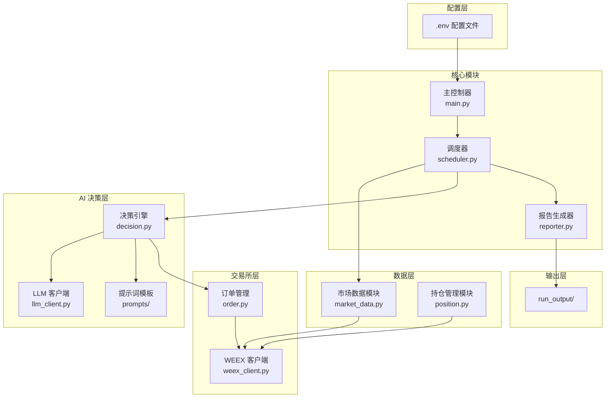
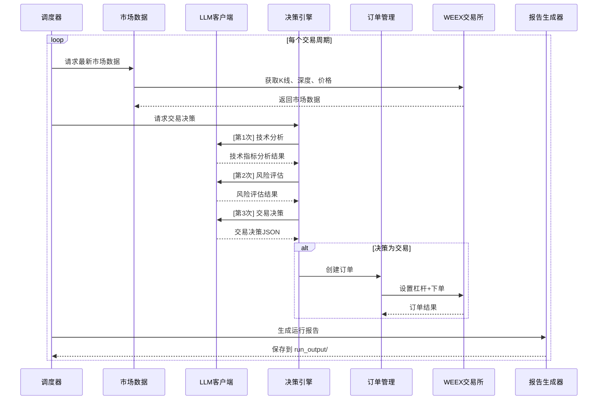
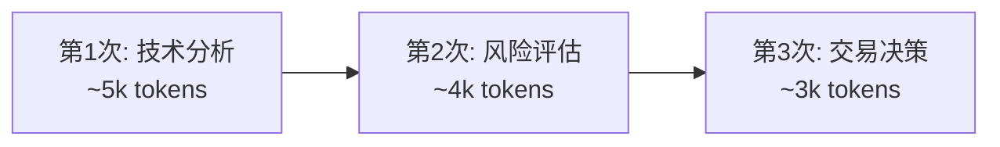

# AI 托管自动交易机器人设计方案

**版本**: v1.1.0  
**最后修改时间**: 2026-01-17 11:15  
**作者**: AI Assistant

---

## 1. 项目概述

### 1.1 目标
开发一个基于 AI（DeepSeek/MiniMax 等模型）的合约自动交易机器人，支持 WEEX 交易所，实现 24 小时不间断自动化交易。

### 1.2 核心特性
- 🤖 AI 驱动决策：使用 OpenRouter 调用 DeepSeek/MiniMax 等模型
- 📊 多时间周期分析：支持长线/短线策略配置
- 💹 WEEX 合约交易：支持杠杆交易、止盈止损
- 🔄 24 小时自动运行：后台守护进程模式
- ⚙️ 灵活配置：通过 .env 文件配置所有参数
- 📝 运行报告：每轮自动生成 Markdown 报告

---

## 2. 系统架构

### 2.1 整体架构图



### 2.2 决策流程时序图



---

## 3. 项目结构

```
trader/
├── .env.example                 # 环境变量示例
├── .env                         # 环境变量配置 (git忽略)
├── pyproject.toml               # uv 项目配置
├── README.md                    # 项目说明
├── docs/
│   └── plan.md                  # 设计文档
├── run_output/                  # 运行报告输出目录
│   └── 20260117_093000_买入_+5.2%.md
│
├── src/
│   └── ai_trader/
│       ├── __init__.py
│       ├── main.py              # 程序入口
│       ├── config.py            # 配置管理
│       ├── scheduler.py         # 调度器
│       ├── reporter.py          # 报告生成器
│       │
│       ├── exchange/            # 交易所模块 (解耦)
│       │   ├── __init__.py
│       │   ├── base.py          # 交易所抽象基类
│       │   ├── weex_client.py   # WEEX API 封装
│       │   ├── order.py         # 订单管理
│       │   └── position.py      # 持仓管理
│       │
│       ├── data/                # 数据模块 (解耦)
│       │   ├── __init__.py
│       │   ├── market_data.py   # 市场数据获取
│       │   ├── indicators.py    # 技术指标计算
│       │   └── history.py       # 历史数据管理
│       │
│       ├── ai/                  # AI 决策模块 (解耦)
│       │   ├── __init__.py
│       │   ├── llm_client.py    # OpenRouter 客户端
│       │   ├── analyzer.py      # 市场分析器
│       │   └── decision.py      # 决策引擎
│       │
│       ├── prompts/             # 提示词模板 (解耦)
│       │   ├── __init__.py
│       │   ├── technical.py     # 技术分析提示词
│       │   ├── risk.py          # 风险评估提示词
│       │   └── trading.py       # 交易决策提示词
│       │
│       ├── models/              # 数据模型 (解耦)
│       │   ├── __init__.py
│       │   ├── market.py        # 市场数据模型
│       │   ├── order.py         # 订单模型
│       │   └── decision.py      # 决策模型
│       │
│       └── utils/               # 工具模块
│           ├── __init__.py
│           └── logger.py        # 日志配置
│
└── tests/                       # 测试目录 (TDD)
    ├── __init__.py
    ├── conftest.py              # pytest fixtures
    ├── test_config.py           # 配置测试
    ├── exchange/
    │   ├── test_weex_client.py
    │   └── test_order.py
    ├── data/
    │   ├── test_market_data.py
    │   └── test_indicators.py
    ├── ai/
    │   ├── test_llm_client.py
    │   ├── test_analyzer.py
    │   └── test_decision.py
    └── test_reporter.py         # 报告生成器测试
```

---

## 4. 环境变量配置

```bash
# .env.example

# ============= 交易所配置 =============
WEEX_API_KEY=your_api_key
WEEX_API_SECRET=your_api_secret
WEEX_PASSPHRASE=your_passphrase
WEEX_API_URL=https://api-contract.weex.com

# ============= 交易对配置 =============
TRADING_SYMBOL=cmt_btcusdt

# ============= AI模型配置 =============
OPENROUTER_API_KEY=your_openrouter_key
AI_MODEL=deepseek/deepseek-chat
AI_FALLBACK_MODEL=minimax/minimax-01

# ============= 杠杆配置 =============
LEVERAGE_MIN=3
LEVERAGE_MAX=10
DEFAULT_LEVERAGE=5

# ============= 风险控制 =============
STOP_LOSS_PERCENT=5
TAKE_PROFIT_PERCENT=10
MAX_POSITION_PERCENT=20

# ============= 交易策略 =============
# short_term | long_term | balanced
TRADING_STRATEGY=balanced
ANALYSIS_INTERVAL=15
DECISION_INTERVAL=60

# ============= 日志配置 =============
LOG_LEVEL=INFO
LOG_FILE=logs/trading.log
```

---

## 5. 核心模块设计

### 5.1 配置管理 (config.py)

```python
"""配置管理模块 - 使用 pydantic-settings"""
from pydantic_settings import BaseSettings
from pydantic import Field
from typing import Literal


class TradingConfig(BaseSettings):
    """交易配置"""
    
    # 交易所配置
    weex_api_key: str = Field(..., env="WEEX_API_KEY")
    weex_api_secret: str = Field(..., env="WEEX_API_SECRET")
    weex_passphrase: str = Field(..., env="WEEX_PASSPHRASE")
    weex_api_url: str = Field(default="https://api-contract.weex.com")
    
    # 交易对
    trading_symbol: str = Field(default="cmt_btcusdt")
    
    # AI 配置
    openrouter_api_key: str = Field(..., env="OPENROUTER_API_KEY")
    ai_model: str = Field(default="deepseek/deepseek-chat")
    ai_fallback_model: str = Field(default="minimax/minimax-01")
    
    # 杠杆配置
    leverage_min: int = Field(default=3)
    leverage_max: int = Field(default=10)
    default_leverage: int = Field(default=5)
    
    # 风险控制
    stop_loss_percent: float = Field(default=5.0)
    take_profit_percent: float = Field(default=10.0)
    max_position_percent: float = Field(default=20.0)
    
    # 交易策略
    trading_strategy: Literal["short_term", "long_term", "balanced"] = "balanced"
    analysis_interval: int = Field(default=15)
    decision_interval: int = Field(default=60)
    
    class Config:
        env_file = ".env"


config = TradingConfig()
```

### 5.2 WEEX 客户端 (exchange/weex_client.py)

```python
"""WEEX 交易所客户端 - 基于 httpx 异步实现"""
import hmac
import hashlib
import time
import json
import httpx
from typing import Optional
from ..config import config


class WeexClient:
    """WEEX 合约 API 客户端"""
    
    def __init__(self):
        self.base_url = config.weex_api_url
        self.api_key = config.weex_api_key
        self.api_secret = config.weex_api_secret
        self.passphrase = config.weex_passphrase
        self._client = httpx.AsyncClient(timeout=30.0)
    
    def _sign(self, timestamp: str, method: str, path: str, body: str = "") -> str:
        """生成 HMAC-SHA256 签名"""
        message = timestamp + method.upper() + path + body
        return hmac.new(
            self.api_secret.encode(),
            message.encode(),
            hashlib.sha256
        ).hexdigest()
    
    def _headers(self, method: str, path: str, body: str = "") -> dict:
        """构造请求头"""
        ts = str(int(time.time() * 1000))
        return {
            "ACCESS-KEY": self.api_key,
            "ACCESS-SIGN": self._sign(ts, method, path, body),
            "ACCESS-PASSPHRASE": self.passphrase,
            "ACCESS-TIMESTAMP": ts,
            "Content-Type": "application/json"
        }
    
    async def get_account(self) -> dict:
        """获取账户信息"""
        path = "/capi/v2/account/getAccounts"
        r = await self._client.get(
            f"{self.base_url}{path}",
            headers=self._headers("GET", path)
        )
        return r.json()
    
    async def get_klines(self, symbol: str, interval: str = "15m", limit: int = 100) -> list:
        """获取K线数据"""
        path = "/capi/v2/market/klines"
        r = await self._client.get(
            f"{self.base_url}{path}",
            params={"symbol": symbol, "interval": interval, "limit": limit}
        )
        return r.json().get("data", [])
    
    async def get_ticker(self, symbol: str) -> dict:
        """获取最新价格"""
        path = "/capi/v2/market/ticker"
        r = await self._client.get(f"{self.base_url}{path}", params={"symbol": symbol})
        return r.json()
    
    async def get_positions(self, symbol: str) -> list:
        """获取当前持仓"""
        path = "/capi/v2/position/getPositions"
        r = await self._client.get(
            f"{self.base_url}{path}",
            headers=self._headers("GET", path),
            params={"symbol": symbol}
        )
        return r.json().get("data", [])
    
    async def set_leverage(self, symbol: str, leverage: int) -> bool:
        """设置杠杆"""
        path = "/capi/v2/account/setLeverage"
        body = json.dumps({"symbol": symbol, "leverage": str(leverage)})
        r = await self._client.post(
            f"{self.base_url}{path}",
            headers=self._headers("POST", path, body),
            content=body
        )
        return r.json().get("code") == "00000"
    
    async def create_order(
        self,
        symbol: str,
        side: str,
        order_type: str,
        size: float,
        price: Optional[float] = None,
        stop_loss: Optional[float] = None,
        take_profit: Optional[float] = None
    ) -> dict:
        """创建订单"""
        path = "/capi/v2/trade/placeOrder"
        body_dict = {"symbol": symbol, "side": side, "orderType": order_type, "size": str(size)}
        if price: body_dict["price"] = str(price)
        if stop_loss: body_dict["stopLossPrice"] = str(stop_loss)
        if take_profit: body_dict["takeProfitPrice"] = str(take_profit)
        body = json.dumps(body_dict)
        r = await self._client.post(
            f"{self.base_url}{path}",
            headers=self._headers("POST", path, body),
            content=body
        )
        return r.json()
    
    async def close(self):
        await self._client.aclose()
```

### 5.3 LLM 客户端 (ai/llm_client.py)

```python
"""OpenRouter LLM 客户端 - 支持结构化输出"""
import json
import httpx
from typing import Optional
from ..config import config
from ..utils.logger import logger


class LLMClient:
    """OpenRouter API 客户端"""
    
    URL = "https://openrouter.ai/api/v1/chat/completions"
    
    def __init__(self):
        self.api_key = config.openrouter_api_key
        self.model = config.ai_model
        self.fallback = config.ai_fallback_model
        self._client = httpx.AsyncClient(timeout=60.0)
    
    async def chat(
        self,
        messages: list[dict],
        schema: Optional[dict] = None,
        max_tokens: int = 2000,
        temperature: float = 0.3
    ) -> dict:
        """发送请求，支持 JSON Schema 结构化输出"""
        headers = {"Authorization": f"Bearer {self.api_key}", "Content-Type": "application/json"}
        payload = {
            "model": self.model,
            "messages": messages,
            "max_tokens": max_tokens,
            "temperature": temperature,
        }
        if schema:
            payload["response_format"] = {
                "type": "json_schema",
                "json_schema": {"name": "response", "strict": True, "schema": schema}
            }
        
        try:
            r = await self._client.post(self.URL, headers=headers, json=payload)
            r.raise_for_status()
            content = r.json()["choices"][0]["message"]["content"]
            return json.loads(content) if schema else {"content": content}
        except Exception as e:
            logger.warning(f"主模型失败，尝试备用: {e}")
            payload["model"] = self.fallback
            r = await self._client.post(self.URL, headers=headers, json=payload)
            content = r.json()["choices"][0]["message"]["content"]
            return json.loads(content) if schema else {"content": content}
    
    async def close(self):
        await self._client.aclose()
```

---

## 6. AI 提示词设计

### 6.1 三阶段调用架构 (控制上下文 ~15k)



每次调用独立进行，将复杂问题拆分，减少幻觉风险。

---

### 6.2 技术分析提示词 (prompts/technical.py)

#### System Prompt

```python
TECHNICAL_SYSTEM = """你是一位专业的加密货币技术分析师。你的任务是分析给定的K线数据和技术指标，提供客观的技术分析结果。

## 分析要求
1. 识别当前趋势（上升/下降/震荡）
2. 找出关键支撑位和阻力位（基于近期高低点和均线）
3. 分析成交量变化趋势
4. 识别K线形态（如锤子线、吞没形态、十字星等）
5. 综合评估信号强度

## 分析原则
- 基于数据客观分析，不要臆测
- 多周期确认：短期信号需要与中期趋势一致
- RSI 超买(>70)/超卖(<30) 需谨慎
- MACD 金叉/死叉 需配合趋势确认
- 布林带收窄预示大行情，但方向不定

## 输出格式
必须严格按照 JSON Schema 输出，不要添加任何额外说明。"""
```

#### User Prompt Template

```python
TECHNICAL_USER = """## 交易对
{symbol}

## 当前价格
{current_price} USDT

## K线数据 (最近{kline_count}根{interval}K线)
| 时间 | 开盘 | 最高 | 最低 | 收盘 | 成交量 |
|------|------|------|------|------|--------|
{kline_table}

## 技术指标
- MA7 (7周期均线): {ma7}
- MA25 (25周期均线): {ma25}
- MA99 (99周期均线): {ma99}
- RSI(14): {rsi}
- MACD: {macd}
- MACD Signal: {macd_signal}
- MACD Histogram: {macd_histogram}
- 布林带上轨: {boll_upper}
- 布林带中轨: {boll_middle}
- 布林带下轨: {boll_lower}
- ATR(14): {atr}

## 近期行情概述
- 24h最高: {high_24h}
- 24h最低: {low_24h}
- 24h涨跌幅: {change_24h}%
- 24h成交量: {volume_24h}

请分析以上数据并给出技术分析结果。"""
```

#### JSON Schema

```python
TECHNICAL_SCHEMA = {
    "type": "object",
    "properties": {
        "trend": {
            "type": "string",
            "enum": ["strong_bullish", "bullish", "neutral", "bearish", "strong_bearish"],
            "description": "当前趋势判断: strong_bullish=强势上涨, bullish=上涨, neutral=震荡, bearish=下跌, strong_bearish=强势下跌"
        },
        "trend_confidence": {
            "type": "number",
            "minimum": 0,
            "maximum": 100,
            "description": "趋势判断的置信度(0-100)"
        },
        "support_levels": {
            "type": "array",
            "items": {"type": "number"},
            "maxItems": 3,
            "description": "支撑位列表，最多3个，按重要性排序"
        },
        "resistance_levels": {
            "type": "array",
            "items": {"type": "number"},
            "maxItems": 3,
            "description": "阻力位列表，最多3个，按重要性排序"
        },
        "volume_trend": {
            "type": "string",
            "enum": ["increasing", "stable", "decreasing"],
            "description": "成交量趋势"
        },
        "pattern": {
            "type": "string",
            "description": "识别到的K线形态，如无则填 'none'"
        },
        "signal_strength": {
            "type": "string",
            "enum": ["strong_buy", "buy", "neutral", "sell", "strong_sell"],
            "description": "综合交易信号强度"
        },
        "key_observations": {
            "type": "array",
            "items": {"type": "string"},
            "maxItems": 5,
            "description": "关键观察点，简洁描述"
        }
    },
    "required": ["trend", "trend_confidence", "support_levels", "resistance_levels", 
                 "volume_trend", "pattern", "signal_strength", "key_observations"],
    "additionalProperties": false
}
```

---

### 6.3 风险评估提示词 (prompts/risk.py)

#### System Prompt

```python
RISK_SYSTEM = """你是一位专业的交易风险管理专家。基于技术分析结果和账户状态，评估当前交易的风险水平，并给出仓位和杠杆建议。

## 核心原则
1. **资金保护优先**：单笔交易风险不超过账户的2-5%
2. **控制频繁交易**：频繁交易会累积手续费成本
3. **杠杆与波动率匹配**：高波动时降低杠杆
4. **考虑当前持仓**：避免同向过度暴露

## 手续费成本提醒
- Taker 费率: 0.072%
- Maker 费率: 0.018%
- 每笔交易需支付开仓+平仓双向手续费
- 例: 10x杠杆做多100USDT本金，手续费约 100*10*0.072%*2 = 1.44 USDT

## 风险评估维度
1. **市场风险**: 趋势不明确、高波动
2. **杠杆风险**: 杠杆过高易爆仓
3. **仓位风险**: 仓位过重无法加仓
4. **流动性风险**: 成交量低难以成交
5. **手续费风险**: 小幅波动可能亏损手续费

## 杠杆建议规则
- 趋势明确 + 低风险 → 建议杠杆范围上限
- 趋势不明确 / 高波动 → 建议杠杆范围下限
- 已有持仓 → 考虑总体暴露度

## 输出格式
必须严格按照 JSON Schema 输出，不要添加任何额外说明。"""
```

#### User Prompt Template

```python
RISK_USER = """## 技术分析结果
- 趋势: {trend} (置信度: {trend_confidence}%)
- 信号强度: {signal_strength}
- 支撑位: {support_levels}
- 阻力位: {resistance_levels}
- 成交量趋势: {volume_trend}
- 识别形态: {pattern}
- 关键观察: {key_observations}

## 账户状态
- 可用余额: {available_balance} USDT
- 总权益: {total_equity} USDT
- 已用保证金: {used_margin} USDT
- 保证金率: {margin_ratio}%

## 当前持仓
{position_info}

## 策略配置
- 策略类型: {strategy_type} (short_term=短线/long_term=长线/balanced=平衡)
- 允许杠杆范围: {leverage_min}x - {leverage_max}x
- 最大仓位比例: {max_position_percent}%
- 默认止损: {stop_loss_percent}%
- 默认止盈: {take_profit_percent}%

## 近期交易记录
最近1小时交易次数: {recent_trade_count}
最近1小时已实现PnL: {recent_pnl} USDT

请评估当前交易风险并给出建议。特别注意：如果最近交易频繁且盈利不佳，应该建议暂停交易。"""
```

#### JSON Schema

```python
RISK_SCHEMA = {
    "type": "object",
    "properties": {
        "risk_level": {
            "type": "string",
            "enum": ["very_low", "low", "medium", "high", "very_high"],
            "description": "综合风险等级"
        },
        "risk_score": {
            "type": "number",
            "minimum": 0,
            "maximum": 100,
            "description": "风险分数(0=最低, 100=最高)"
        },
        "recommended_leverage": {
            "type": "integer",
            "minimum": 1,
            "maximum": 125,
            "description": "建议杠杆倍数"
        },
        "recommended_position_percent": {
            "type": "number",
            "minimum": 0,
            "maximum": 100,
            "description": "建议仓位占可用余额的百分比"
        },
        "should_trade": {
            "type": "boolean",
            "description": "当前是否适合交易"
        },
        "fee_warning": {
            "type": "boolean",
            "description": "是否存在手续费风险(频繁交易/小幅波动)"
        },
        "risk_factors": {
            "type": "array",
            "items": {"type": "string"},
            "maxItems": 5,
            "description": "主要风险因素"
        },
        "mitigation_suggestions": {
            "type": "array",
            "items": {"type": "string"},
            "maxItems": 3,
            "description": "风险缓解建议"
        }
    },
    "required": ["risk_level", "risk_score", "recommended_leverage", 
                 "recommended_position_percent", "should_trade", "fee_warning",
                 "risk_factors", "mitigation_suggestions"],
    "additionalProperties": false
}
```

---

### 6.4 交易决策提示词 (prompts/trading.py)

#### System Prompt

```python
TRADING_SYSTEM = """你是一位经验丰富的加密货币合约交易员。基于技术分析和风险评估结果，做出具体的交易决策。

## 决策原则
1. **顺势交易**: 只在趋势明确时开仓，优先选择与趋势一致的方向
2. **严格止损**: 每笔交易必须设置止损，止损位应在支撑/阻力位之外
3. **合理止盈**: 止盈目标应考虑阻力位和风险回报比
4. **避免过度交易**: 没有明确信号时选择观望(hold)
5. **考虑手续费**: 小幅波动不值得频繁交易
6. **保持耐心**: 宁可错过，不可做错

## 操作类型说明
| 操作 | 说明 |
|------|------|
| open_long | 开多仓（看涨）|
| open_short | 开空仓（看跌）|
| close_long | 平掉多仓 |
| close_short | 平掉空仓 |
| add_long | 多仓加仓 |
| add_short | 空仓加仓 |
| reduce_long | 多仓减仓 |
| reduce_short | 空仓减仓 |
| hold | 保持现状不操作 |

## 止损止盈设置规则
- 止损应设置在最近支撑位(多)/阻力位(空)之外 1-2%
- 风险回报比至少 1:1.5，理想为 1:2 或更高
- 止盈可分批设置（本系统简化为单一止盈点）

## 开仓条件（至少满足2条）
- 趋势明确（趋势置信度 > 60%）
- 信号强度为 buy/strong_buy 或 sell/strong_sell
- 风险评估显示 should_trade = true
- 价格接近关键支撑/阻力位
- 成交量配合

## 观望条件（满足任一条）
- 风险评估 should_trade = false
- 手续费警告 fee_warning = true 且无明确趋势
- 趋势置信度 < 50%
- 信号强度为 neutral
- 已有持仓且方向与当前信号相反

## 输出格式
必须严格按照 JSON Schema 输出，不要添加任何额外说明。
如果决策为 hold，仍需填写其他字段（可使用合理默认值）。"""
```

#### User Prompt Template

```python
TRADING_USER = """## 技术分析摘要
- 趋势: {trend} (置信度: {trend_confidence}%)
- 信号强度: {signal_strength}
- 支撑位: {support_levels}
- 阻力位: {resistance_levels}
- 成交量趋势: {volume_trend}
- 识别形态: {pattern}
- 关键观察: {key_observations}

## 风险评估摘要
- 风险等级: {risk_level} (分数: {risk_score}/100)
- 建议杠杆: {recommended_leverage}x
- 建议仓位: {recommended_position_percent}%
- 适合交易: {should_trade}
- 手续费警告: {fee_warning}
- 风险因素: {risk_factors}
- 缓解建议: {mitigation_suggestions}

## 当前市场状态
- 当前价格: {current_price} USDT
- 24h涨跌幅: {change_24h}%

## 当前持仓
{position_info}

## 策略偏好
- 策略类型: {strategy_type}
- 杠杆范围: {leverage_min}x - {leverage_max}x
- 默认止损: {stop_loss_percent}%
- 默认止盈: {take_profit_percent}%

## 账户余额
- 可用余额: {available_balance} USDT

请做出交易决策。如果市场不明朗或风险过高，请选择 hold（观望）。"""
```

#### JSON Schema

```python
TRADING_SCHEMA = {
    "type": "object",
    "properties": {
        "action": {
            "type": "string",
            "enum": ["open_long", "open_short", "close_long", "close_short",
                     "add_long", "add_short", "reduce_long", "reduce_short", "hold"],
            "description": "交易操作类型"
        },
        "confidence": {
            "type": "number",
            "minimum": 0,
            "maximum": 100,
            "description": "决策置信度(0-100)"
        },
        "leverage": {
            "type": "integer",
            "minimum": 1,
            "maximum": 125,
            "description": "使用的杠杆倍数"
        },
        "position_size_percent": {
            "type": "number",
            "minimum": 0,
            "maximum": 100,
            "description": "仓位占可用余额的百分比"
        },
        "entry_price": {
            "type": "number",
            "description": "建议入场价格(市价单填0)"
        },
        "stop_loss_price": {
            "type": "number",
            "description": "止损价格"
        },
        "take_profit_price": {
            "type": "number",
            "description": "止盈价格"
        },
        "order_type": {
            "type": "string",
            "enum": ["market", "limit"],
            "description": "订单类型: market=市价, limit=限价"
        },
        "reasoning": {
            "type": "string",
            "maxLength": 300,
            "description": "决策理由(简明扼要)"
        },
        "execution_urgency": {
            "type": "string",
            "enum": ["immediate", "wait_for_price", "low_priority"],
            "description": "执行紧迫程度"
        }
    },
    "required": ["action", "confidence", "leverage", "position_size_percent",
                 "entry_price", "stop_loss_price", "take_profit_price",
                 "order_type", "reasoning", "execution_urgency"],
    "additionalProperties": false
}
```

---

### 6.5 提示词调用示例

```python
"""决策引擎中的提示词调用示例"""

async def analyze_technical(self, market_data: MarketData) -> dict:
    """技术分析 - 第1次LLM调用"""
    user_prompt = TECHNICAL_USER.format(
        symbol=market_data.symbol,
        current_price=market_data.current_price,
        kline_count=len(market_data.klines),
        interval=market_data.interval,
        kline_table=self._format_klines(market_data.klines[-20:]),
        ma7=market_data.indicators.ma7,
        ma25=market_data.indicators.ma25,
        ma99=market_data.indicators.ma99,
        rsi=market_data.indicators.rsi,
        macd=market_data.indicators.macd,
        macd_signal=market_data.indicators.macd_signal,
        macd_histogram=market_data.indicators.macd_histogram,
        boll_upper=market_data.indicators.boll_upper,
        boll_middle=market_data.indicators.boll_middle,
        boll_lower=market_data.indicators.boll_lower,
        atr=market_data.indicators.atr,
        high_24h=market_data.high_24h,
        low_24h=market_data.low_24h,
        change_24h=market_data.change_24h,
        volume_24h=market_data.volume_24h
    )
    
    return await self.llm.chat(
        messages=[
            {"role": "system", "content": TECHNICAL_SYSTEM},
            {"role": "user", "content": user_prompt}
        ],
        schema=TECHNICAL_SCHEMA,
        max_tokens=1000,
        temperature=0.3
    )
```

---

## 7. 报告生成器 (reporter.py)

```python
"""运行报告生成器 - 每轮生成 Markdown 报告"""
from datetime import datetime
from pathlib import Path
from typing import Optional
from .models.decision import TradingDecision, TechnicalAnalysisResult
from .models.market import MarketData
from .models.order import Position


class Reporter:
    """报告生成器"""
    
    def __init__(self, output_dir: str = "run_output"):
        self.output_dir = Path(output_dir)
        self.output_dir.mkdir(exist_ok=True)
    
    def generate(
        self,
        market_data: MarketData,
        tech_analysis: TechnicalAnalysisResult,
        decision: TradingDecision,
        position_before: Optional[Position],
        position_after: Optional[Position],
        pnl: float = 0.0
    ) -> Path:
        """生成运行报告"""
        now = datetime.now()
        action_name = self._action_to_chinese(decision.action)
        pnl_str = f"+{pnl:.2f}%" if pnl >= 0 else f"{pnl:.2f}%"
        
        filename = f"{now.strftime('%Y%m%d_%H%M%S')}_{action_name}_{pnl_str}.md"
        filepath = self.output_dir / filename
        
        content = f"""# 交易运行报告

**时间**: {now.strftime('%Y-%m-%d %H:%M:%S')}  
**交易对**: {market_data.symbol}  
**操作**: {action_name}  
**PnL**: {pnl_str}

---

## 1. 市场数据摘要

| 指标 | 数值 |
|------|------|
| 当前价格 | {market_data.current_price:.4f} |
| MA7 | {market_data.indicators.ma7:.4f} |
| MA25 | {market_data.indicators.ma25:.4f} |
| RSI(14) | {market_data.indicators.rsi:.2f} |
| MACD | {market_data.indicators.macd:.4f} |

---

## 2. AI 技术分析

- **趋势**: {tech_analysis.trend} (置信度: {tech_analysis.trend_confidence}%)
- **信号强度**: {tech_analysis.signal_strength}
- **支撑位**: {tech_analysis.support_levels}
- **阻力位**: {tech_analysis.resistance_levels}
- **关键观察**:
{self._format_list(tech_analysis.key_observations)}

---

## 3. 交易决策

- **操作**: {decision.action}
- **置信度**: {decision.confidence}%
- **杠杆**: {decision.leverage}x
- **仓位比例**: {decision.position_size_percent}%
- **止损价**: {decision.stop_loss_price}
- **止盈价**: {decision.take_profit_price}
- **订单类型**: {decision.order_type}
- **理由**: {decision.reasoning}

---

## 4. 持仓变化

### 变化前
{self._format_position(position_before)}

### 变化后
{self._format_position(position_after)}

---

## 5. 账户 PnL

**本轮盈亏**: {pnl_str}
"""
        filepath.write_text(content, encoding="utf-8")
        return filepath
    
    def _action_to_chinese(self, action: str) -> str:
        mapping = {
            "open_long": "买入开多", "open_short": "卖出开空",
            "close_long": "平多", "close_short": "平空",
            "add_long": "加多仓", "add_short": "加空仓",
            "reduce_long": "减多仓", "reduce_short": "减空仓",
            "hold": "持仓观望"
        }
        return mapping.get(action, action)
    
    def _format_position(self, pos: Optional[Position]) -> str:
        if not pos:
            return "无持仓"
        return f"- 方向: {'多' if pos.side == 'long' else '空'}\n- 数量: {pos.size}\n- 开仓价: {pos.entry_price}\n- 未实现盈亏: {pos.unrealized_pnl}"
    
    def _format_list(self, items: list) -> str:
        return "\n".join(f"  - {item}" for item in items)
```

---

## 8. TDD 测试策略

### 8.1 测试命令

```bash
# 运行所有测试
uv run pytest tests/ -v

# 运行特定模块
uv run pytest tests/exchange/ -v
uv run pytest tests/ai/ -v

# 运行覆盖率
uv run pytest tests/ --cov=src/ai_trader --cov-report=html
```

### 8.2 Mock 策略

| 模块 | Mock 对象 |
|------|-----------|
| `weex_client.py` | Mock `httpx.AsyncClient` |
| `llm_client.py` | Mock OpenRouter API 响应 |
| `reporter.py` | 验证文件输出 |

---

## 9. 运行说明

```bash
# 1. 初始化项目
uv init
uv add httpx pydantic pydantic-settings python-dotenv
uv add --dev pytest pytest-asyncio pytest-cov

# 2. 配置环境变量
cp .env.example .env
# 编辑 .env 填入 API Key

# 3. 运行测试
uv run pytest tests/ -v

# 4. 启动机器人
uv run python -m ai_trader.main
```

---

## 10. 验证方案

### 10.1 单元测试
- 每个模块独立测试
- Mock 外部依赖

### 10.2 集成测试
- 使用 WEEX testnet（如有）
- 小额真实交易验证

### 10.3 手动验证
1. 检查 `run_output/` 目录生成的报告
2. 确认报告内容完整
3. 验证止盈止损设置正确
